# 无线网络基础

## 数字通信基础 (page 1-40)

### 信号的基本概念 (page 6-10)

#### 信号的定义与分类

信号是表示数据的物理量，是时间和位置的函数。在通信系统中，信号承载着需要传输的信息。

> [!definition]+ 信号的分类
>
> 根据时间和取值的特性，信号可以分为:
>
> - **连续时间/离散时间**:信号在时间轴上是连续的还是离散的采样点
> - **连续值/离散值**:信号的幅度是连续变化还是只能取有限个离散值
> - **模拟信号** = 连续时间 + 连续值:某一电参量（幅度、频率）在一定取值范围内连续变化
> - **数字信号** = 离散时间 + 离散值:某一电参量在一定取值范围内跳变，仅有有限个取值

**从模拟到数字的转换过程**:

模拟信号要转换为数字信号，需要经过三个关键步骤:

1. **采样（Sampling）**:将连续时间信号在离散时刻取样，得到离散时间信号
2. **量化（Quantization）**:将连续幅度值映射到有限个离散电平
3. **编码（Encoding）**:将量化后的离散值用二进制码表示

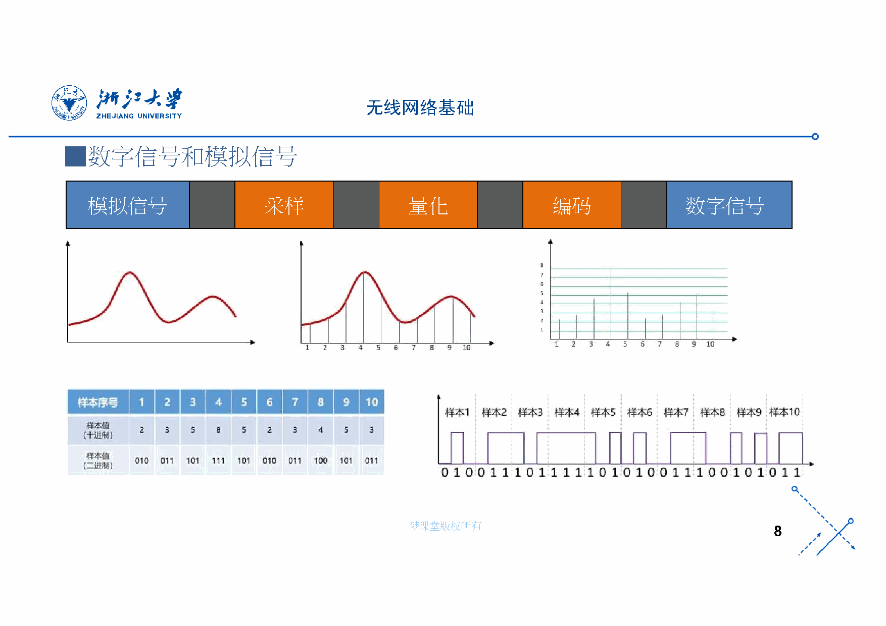

**数字信号的优势**:

由于模拟信号结构复杂、抗干扰能力差，而数字信号结构简单、抗干扰能力强，现代通信系统中模拟通信必然被数字通信取代。数字信号的主要优点包括:

- 易于处理和存储
- 可以利用纠错编码提高可靠性
- 便于加密，保护信息安全
- 易于与计算机系统集成

#### 周期信号的参数 (page 9)

对于周期性变化的信号，有几个重要的描述参数:

- **周期（Period， $T$）**:信号完成一次完整振荡所需的时间，单位为秒(s)
- **频率（Frequency， $f$）**:单位时间内信号振荡的次数，$f = 1/T$，单位为赫兹(Hz)
- **幅度（Amplitude， $A$）**:信号的最大偏移量，表示信号的强度
- **相位偏移（Phase Offset， $\phi$）**:信号波形相对于参考时刻的偏移角度

正弦波是最基本的周期信号，其数学表达式为:

$$
s(t) = A \sin(2\pi f t + \phi)
$$

其中 $2\pi f$ 称为角频率 $\omega$，单位为弧度/秒(rad/s)。

### 频率、频谱与带宽 (page 11-16)

#### 频率的含义 (page 11-12)

频率描述了波峰在特定时间段内通过固定点的次数。频率越高，单位时间内振荡次数越多，波长越短。

**频率单位换算**:

- 1，000 Hz = 1 千赫兹 (kHz)
- 1，000，000 Hz = 1 兆赫兹 (MHz)
- 1，000，000，000 Hz = 1 吉赫兹 (GHz)

例如，蜂窝电话产生的无线电磁波频率约为 700~900 MHz，而 WiFi 工作在 2.4 GHz 或 5 GHz 频段。

#### 复杂信号的频谱 (page 13)

实际通信中传输的信号通常不是单一频率的正弦波，而是由多个不同频率的正弦波叠加而成。根据傅里叶分析理论，任何周期信号都可以分解为一系列不同频率、幅度和相位的正弦波之和。

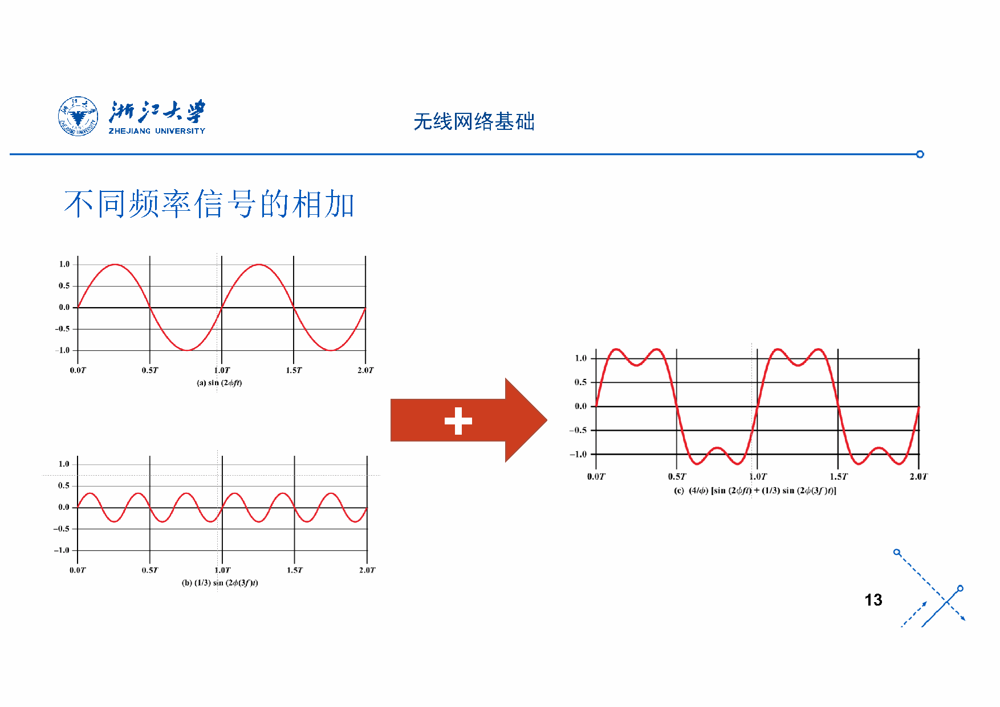

这种将信号分解为不同频率成分的表示方法称为**频域表示**，对应的幅度-频率关系图称为**频谱（Spectrum）**。

#### 带宽的定义 (page 14)

> [!definition]+ 带宽
>
> **有效带宽（Bandwidth）**:包含信号主要能量的频率范围的宽度，通常定义为从最低有效频率到最高有效频率的差值，单位为 Hz。
>
> 带宽决定了信号传输所需的频率资源，也直接影响信道的数据传输能力。

**电磁频谱**:电磁波所有可能频率的集合称为电磁频谱。其中:

- 从 3 kHz 到 300 GHz 的频率范围称为**无线频谱**或**射频（Radio Frequency， RF）**
- 不同频段有不同的传播特性和应用场景

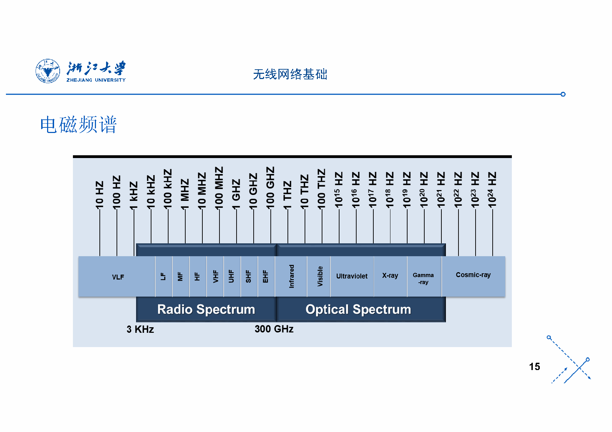

#### 频段分配 (page 16-17)

无线电频谱是稀缺的公共资源，需要由政府机构（如美国的 FCC）进行统一分配和管理。频段分为两大类:

**授权频段（Licensed Bands）**:

- 由政府机构授权给特定用户或运营商使用
- 每个区域只有一个用户，避免相互干扰
- 通常为"窄带"信道，带宽为 6.25、12.5 或 25 kHz
- 例如:移动蜂窝网络使用的频段
    - GSM: 900 MHz， 1800 MHz (欧洲); 850 MHz， 1900 MHz (美国)
    - UMTS， LTE: 各国分配的专用频段

**免授权频段（Unlicensed Bands）**:

- 工业、科学和医疗（ISM， Industrial， Scientific and Medical）频段
- 无需申请授权，任何设备都可以使用
- 必须是宽带（至少 5 MHz），并限制发射功率以减少相互干扰
- 例如:
    - 2.4 GHz ISM 频段:IEEE 802.11b/g (WiFi)、Bluetooth、Zigbee、微波炉
    - 5.8 GHz ISM 频段:IEEE 802.11a/ac (WiFi)

### 调制与解调 (page 18-36)

#### 基带与射频的概念 (page 19-20)

在深入了解调制之前，需要理解两个核心概念:

> [!definition]+ 基带与射频
>
> **基带（Baseband）**:
> - 指频率范围在零频附近（从直流到几百 kHz）的特殊频率带宽
> - 基带信号是最"基础"的信号，直接承载原始信息
> - 在移动通信中，基带芯片、基带电路（统称基带）负责信号的编码、解码和基础处理
>
> **射频（Radio Frequency， RF）**:
> - 指频率范围在 300 kHz ~ 300 GHz 的高频电磁波
> - 频率低于 100 kHz 的电磁波会被地表吸收，无法有效传输
> - 频率高于 100 kHz 的电磁波可以在空气中传播，并经电离层反射形成远距离传输
> - 射频电路、射频芯片（统称为射频）负责产生和处理射频信号

#### 调制的作用与意义 (page 18， 21)

调制（Modulation）是将基带信号转换为适合在信道中传输的频带信号的过程。调制包括两个主要步骤:

1. **数字调制**:将数字数据转换为模拟基带信号
2. **模拟调制**:将基带信号的中心频率调制到无线电载波频率

**调制的必要性**:

- **实现频谱展宽**:将信号搬移到适合传输的频段
- 实现频分复用:多个信号可以使用不同的载波频率同时传输，提高频谱利用率
- 匹配天线尺寸:有效天线长度与波长相关，低频信号需要很长的天线，调制到高频后可以使用合理尺寸的天线
- 改善抗干扰性能:通过选择合适的调制方式和载波频率，可以提高信号的抗干扰能力

**调制技术**有：线性调制、恒包络调制、混合调制

#### 模拟调制 (page 22-27)

模拟调制是通过改变载波的某个参数（幅度、频率或相位）来表示基带信号的过程。载波通常是一个高频正弦波:

$$
c(t) = A_c \sin(2\pi f_c t + \phi_c)
$$

其中 $A_c$ 是载波幅度，$f_c$ 是载波频率，$\phi_c$ 是载波初始相位。

**三种基本模拟调制方式**:

1. **幅度调制（AM， Amplitude Modulation）** (page 23)

改变载波的幅度来表示基带信号。已调信号的幅度随基带信号的幅度变化而变化:

$$
s_{AM}(t) = [A_c + m(t)] \sin(2\pi f_c t)
$$

其中 $m(t)$ 是基带信号。AM 调制实现简单，但抗干扰能力较差，容易受到噪声影响。广泛应用于 AM 广播电台。

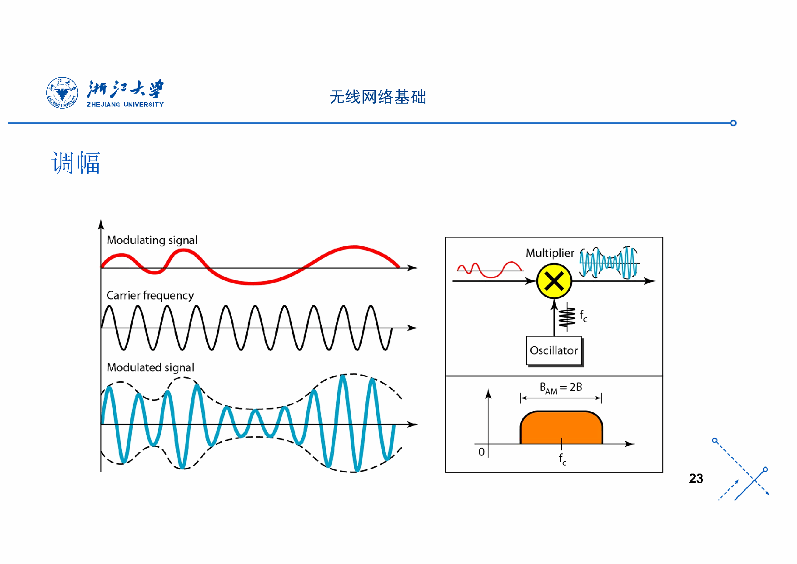

2. **频率调制（FM， Frequency Modulation）** (page 24)

改变载波的瞬时频率来表示基带信号。当基带信号幅度增大时，载波频率升高;基带信号幅度减小时，载波频率降低:

$$
s_{FM}(t) = A_c \sin\left(2\pi f_c t + 2\pi k_f \int_0^t m(\tau) d\tau\right)
$$

其中 $k_f$ 是频率灵敏度。FM 调制的抗干扰能力强于 AM，音质更好，广泛应用于 FM 广播和模拟电视伴音。

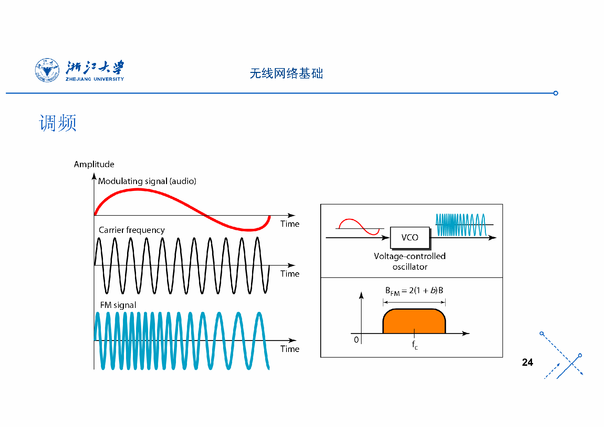

3. **相位调制（PM， Phase Modulation）** (page 25-26)

改变载波的相位来表示基带信号:

$$
s_{PM}(t) = A_c \sin(2\pi f_c t + k_p m(t))
$$

其中 $k_p$ 是相位灵敏度。

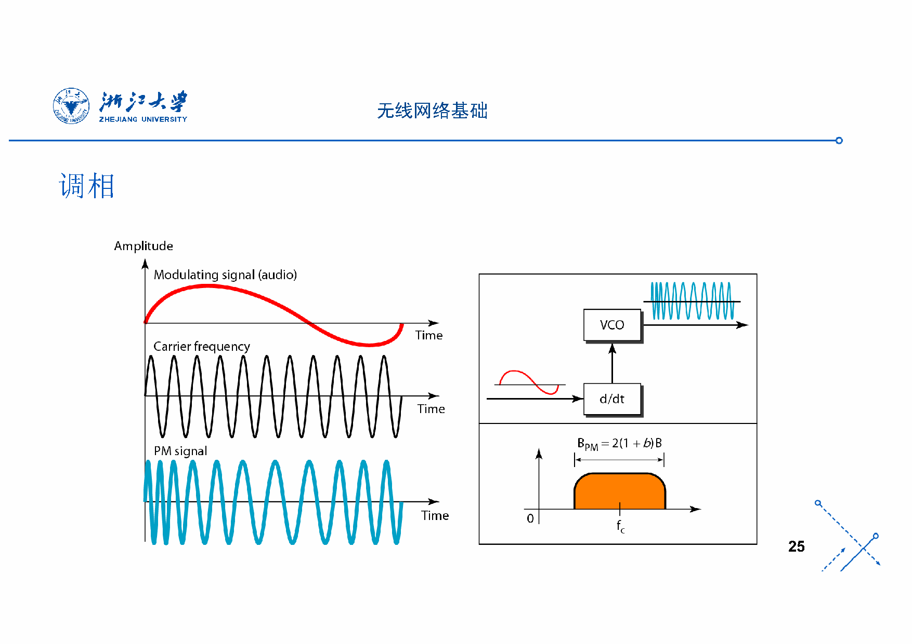

**瞬时相位与瞬时频率的关系**:

瞬时相位对时间求导得到瞬时角频率:

$$
\omega_i(t) = \frac{d\phi(t)}{dt} = 2\pi f_c + k_p \frac{dm(t)}{dt}
$$

因此 PM 和 FM 在数学上密切相关，PM 相当于对基带信号微分后进行 FM。


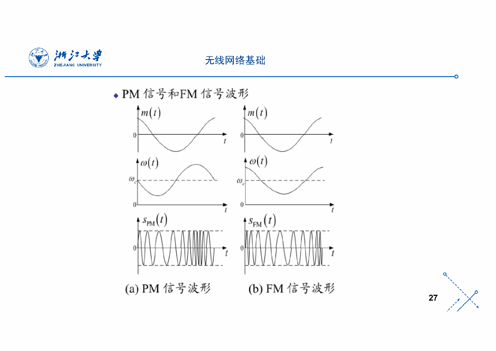

#### 数字调制 (page 28-36)

数字调制也称为**移位键控（Shift Keying）**，是用载波的离散状态来表示数字数据的过程。

**三种基本数字调制方式** (page 28):

1. **幅移键控（ASK， Amplitude Shift Keying）**

用不同的幅度表示数字 0 和 1:
- 比特 1:发送高幅度载波
- 比特 0:发送低幅度载波或不发送

**特点**:
- 实现简单，带宽要求低
- 但非常容易受到干扰，误码率高
- 适合在光纤中传输数字数据（光强度调制）

2. **频移键控（FSK， Frequency Shift Keying）**

用不同的频率表示数字 0 和 1:
- 比特 1:发送频率 $f_1$ 的载波
- 比特 0:发送频率 $f_0$ 的载波

**特点**:
- 不像 ASK 那么容易出错，实现起来较容易，抗噪声与抗衰减的性能较好
- 需要更大的带宽
- 用于高频（3 至 30 MHz）无线通信
- 在中低速数据传输中得到广泛应用

3. **相移键控（PSK， Phase Shift Keying）**

用不同的相位表示数字 0 和 1:
- 比特 1:发送相位为 $\phi_1$ 的载波
- 比特 0:发送相位为 $\phi_0$ 的载波

**特点**:
- 实现较复杂
- 抗干扰能力强，误码率低
- 频谱效率高，是现代无线通信的主流选择

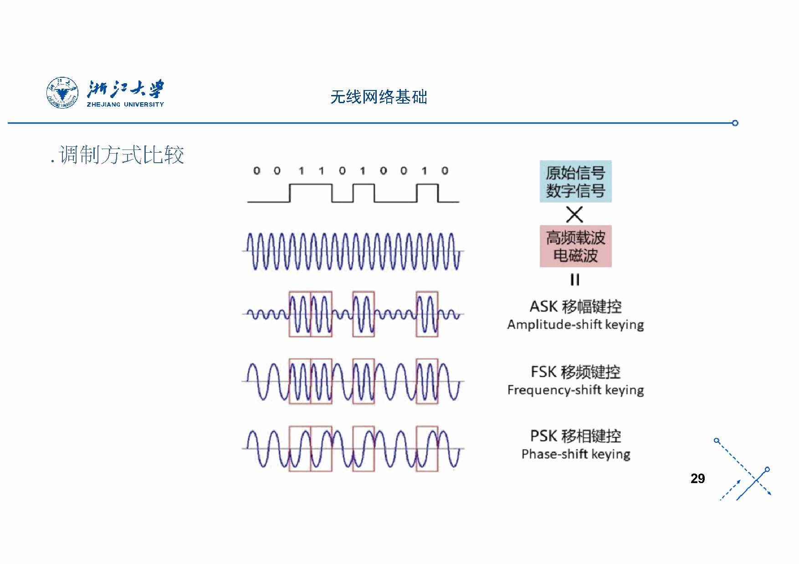

#### 高级相移键控技术 (page 31-36)

**BPSK（二进制相移键控， Binary Phase Shift Keying）**:

最简单的相移键控方式:
- 比特 0:发送正弦波 ($\phi = 0°$)
- 比特 1:发送倒相正弦波 ($\phi = 180°$)

**特点**:
- 实现非常简单
- 频谱效率低（每个码元只传输 1 比特）
- 鲁棒性强，常用于卫星通信等恶劣环境

**QPSK（正交相移键控， Quadrature Phase Shift Keying）**:

2 个比特编码为一个码元，使用 4 个不同的相位状态:
- 00: $\phi = 45°$
- 01: $\phi = 135°$
- 10: $\phi = 225°$
- 11: $\phi = 315°$

**特点**:
- 与 BPSK 相比频谱效率提高一倍
- 在相同带宽下可以传输两倍的数据
- 实现较复杂，但仍然广泛应用
- 抗干扰性能好，在有衰落的信道中也能获得良好效果

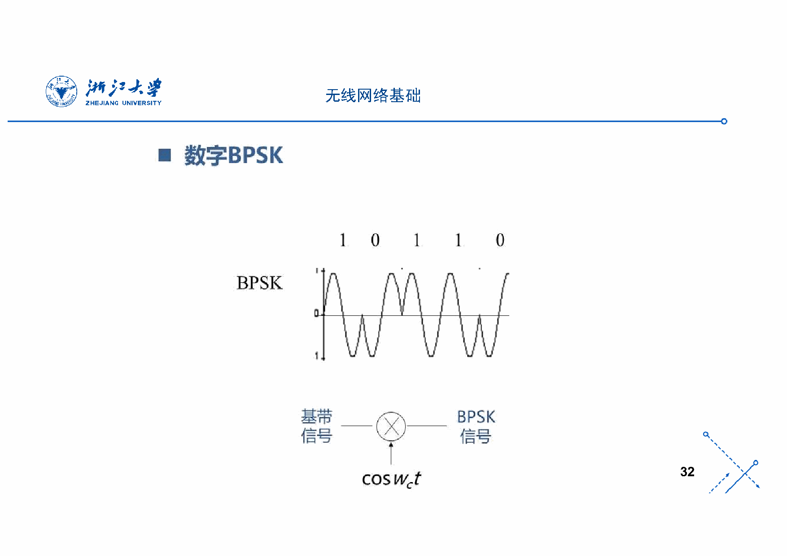

**QAM（正交幅度调制， Quadrature Amplitude Modulation）** (page 34-35):

结合了幅度调制和相位调制，同时改变载波的幅度和相位来表示数字数据。

QAM 可以使用一个码元对 $n$ 比特进行编码，有 $2^n$ 个离散状态。常见的有:
- 16-QAM:每个码元传输 4 比特
- 64-QAM:每个码元传输 6 比特
- 256-QAM:每个码元传输 8 比特

**星座图分析**:

在星座图中，每个点代表一个可能的码元状态。例如:
- 码元 0011 和 0001 具有相同的相位 $\phi$，但幅度 $a$ 不同
- 码元 0000 和 1000 有不同的相位但幅度相同

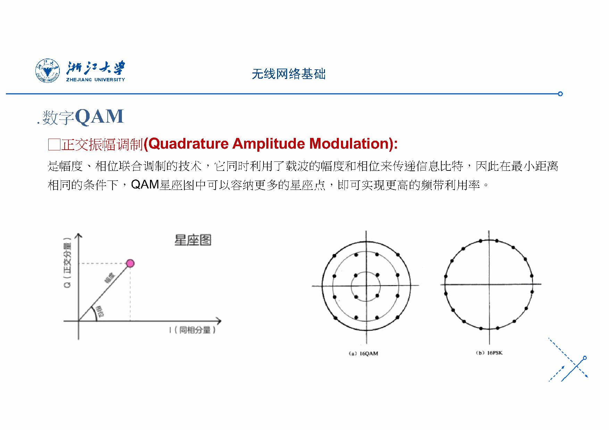

**性能权衡**:

QAM 的优点是频谱效率高，在相同带宽下可以传输更多数据。但随着 $n$ 的增加:
- 星座点之间距离变小
- 对噪声更加敏感
- 误码率随 $n$ 增加而上升
- 需要更高的信噪比才能保持相同的误码率

尽管如此，<u>与可比较的 PSK 方案相比，QAM 在相同星座点数量下误码率更低</u>，因此被广泛应用于高速数据传输，如 4G LTE、5G、有线电视 DOCSIS 等。

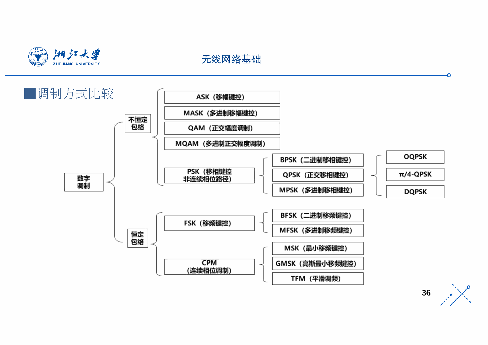

### 编码与解码 (page 37-42)

在无线通信系统中，编码处理发生在调制之前，是确保数据高效、可靠传输的关键环节。根据目的不同，编码可分为信源编码和信道编码两大类。

#### 信源编码与信道编码的区别 (page 37)

> [!definition]+ 信源编码 vs 信道编码
>
> **信源编码（Source Coding）**:
> - **主要目的**:实现数据压缩，减少信源的数据量
> - **核心思想**:去除信息中的冗余，减少对信道的占用
> - **典型应用**:音视频压缩
>
> **信道编码（Channel Coding）**:
> - **主要目的**:改善链路性能，提高传输可靠性
> - **核心思想**:有目的地增加冗余，使信号具有检错或纠错能力
> - **典型应用**:提高抗干扰、抗衰落能力

信源编码和信道编码的目标看似矛盾:一个减少冗余，一个增加冗余。但它们的作用不同:信源编码去除的是信息本身的冗余（对理解内容无用的部分），而信道编码添加的是用于对抗传输错误的保护性冗余。

#### 信源编码 (page 38)

信源编码针对不同类型的媒体数据，采用不同的压缩算法:

**音频编码**:
- **WAV**:无压缩音频格式，音质最佳但体积大
- **MP3**:有损压缩，压缩比约 10:1，广泛应用
- **AAC**:比 MP3 更先进，同等码率下音质更好
- **AMR-NB/AMR-WB**:自适应多速率编码，用于移动通信语音
- **EVS/IVAS**:增强型语音服务编码，用于 VoLTE 和 5G

**视频编码**:
- **MPEG-4**:早期互联网视频标准
- **H.263**:用于低比特率视频通信
- **H.264/AVC**:目前最广泛使用的视频编码标准
- **H.265/HEVC**:高效视频编码，比 H.264 效率提高约 50%

#### 信道编码的作用 (page 39)

信道编码通过增加冗余比特，使接收端能够检测甚至纠正传输过程中产生的错误。

**无信道编码时**:

噪声直接影响数据比特，接收端无法判断哪些比特是错误的:

```
发送: 1 0 1 1 0 1 0 0
噪声: ↓     ↓       ↓
接收: 0 0 1 0 0 1 1 0  (3个错误，无法检测)
```

**有信道编码时**:

发送端添加校验比特，接收端利用冗余信息检测并纠正错误:

```
发送: 1 0 1 1 | 0 1 0 1 0 0 | 1 0 (数据+校验)
噪声:     ↓         ↓
接收: 1 0 0 1 | 0 1 1 1 0 0 | 1 0
检错: 检测到第3位和第7位错误
纠错: 1 0 1 1 | 0 1 0 1 0 0 | 1 0 (恢复正确数据)
```

通过信道编码，即使部分比特在传输中出错，接收端仍然可以恢复出正确的信息，大大提高了通信的可靠性。

#### 信道编码的分类 (page 40-41)

**按纠错检错能力分类**:

- **检错码（Error Detection Code）**:只能检测错误，不能纠正，如 CRC 循环冗余校验
- **纠错码（Error Correction Code）**:既能检测又能纠正一定数量的错误，如汉明码、BCH码
- **纠删码（Erasure Code）**:在已知错误位置的情况下进行纠错

**按检验关系分类**:

- **线性码**:码字的线性组合仍是码字，如汉明码
- **非线性码**:不满足线性性质的码

**按约束关系分类**:

1. **分组码（Block Code）** (page 41)

将信息序列分组后独立编码。每 $k$ 个信息比特分为一组，编码后变成长度为 $n$ 的码字（$n > k$）。任意码字的监督比特（$n-k$ 位）只与本码组的信息比特有关，不同码组之间相互独立。

**特点**:
- 编码和译码相对简单
- 适合纠正随机错误
- 常见的有汉明码、BCH码、RS码等

**例子**:$(7，4)$ 汉明码，将 4 个信息比特编码为 7 个比特，增加 3 个校验比特，可以纠正 1 个比特错误。

2. **卷积码（Convolutional Code）** (page 41)

可以看作特殊的分组码，但监督比特不仅与本组的信息比特有关，还与前若干组的信息比特有关。编码器包含移位寄存器，具有"记忆"功能。

**特点**:
- 纠错能力强
- 不仅可纠正随机差错，还可纠正突发差错
- 广泛应用于卫星通信、移动通信

**工作原理**:
当前时刻的输出不仅取决于当前输入，还取决于移位寄存器中存储的之前若干时刻的输入，因此称为"卷积"。

3. **Turbo 码**（page 41）

Turbo 码是一种强大的信道编码技术，在 3G/4G 移动通信中广泛应用。

**核心思想**:

巧妙地将两个简单的分量码（通常是卷积码）通过伪随机交织器并行级联，构造出具有伪随机特性的长码。在译码端，通过两个软入/软出（SISO）译码器之间进行多次迭代，实现伪随机译码。

**性能**:

Turbo 码的性能远超其他编码方式，在合理的复杂度下可以非常接近香农极限。在相同误码率下，Turbo 码所需的信噪比比传统卷积码低 2-3 dB。

### 射频通信系统 (page 42)

一个完整的射频（Radio Frequency， RF）通信系统包括发送端和接收端，信号经过多个处理阶段完成从基带到射频、再从射频到基带的转换。

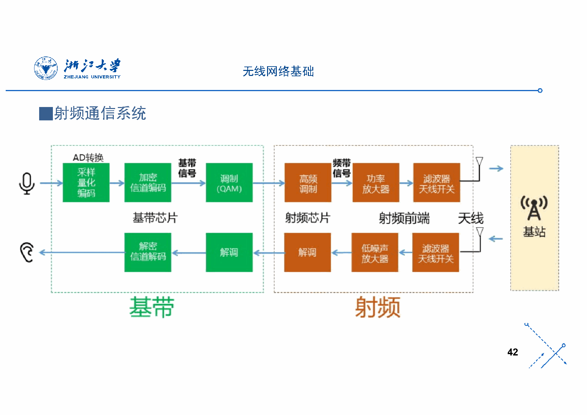

#### 发送端处理流程

1. **基带信号处理**
    - 对原始数据进行信源编码（压缩）
    - 进行信道编码（添加纠错能力）
    - 可选:加密处理，保护信息安全

2. **中频调制**
    - 将数字基带信号调制到中频（IF， Intermediate Frequency）
    - 中频通常选择几十到几百 MHz
    - 便于后续处理和滤波

3. **上变频（Up-conversion）**
    - 将中频信号搬移到射频载波频率
    - 例如从 70 MHz 中频上变频到 2.4 GHz
    - 通过混频器实现频率搬移

1. **功率放大（PA， Power Amplifier）**
    - 增大信号功率以便远距离传输
    - 发射功率取决于覆盖距离和法规限制
    - 例如 WiFi 发射功率通常为 100 mW (20 dBm)

5. **天线辐射**
    - 将电信号转换为电磁波辐射到空间
    - 天线设计需要匹配工作频率

#### 接收端处理流程

1. **天线接收**
    - 捕获空间中的电磁波
    - 将电磁波转换为微弱的电信号

2. **低噪声放大（LNA， Low Noise Amplifier）**
    - 放大微弱的接收信号
    - 引入的噪声要尽可能小，否则会降低信噪比
    - LNA 是决定接收机灵敏度的关键部件

3. **下变频（Down-conversion）**
    - 将射频信号搬移到中频
    - 降低后续处理的难度

4. **中频解调**
    - 从中频信号中恢复基带信号
    - 对应发送端的调制过程

5. **基带处理**
    - 信道解码:利用冗余信息纠正传输错误
    - 信源解码:解压缩，恢复原始数据
    - 解密:恢复明文信息

### 信道容量理论 (page 43-50)

#### 容量的基本概念 (page 43-45)

> [!definition]+ 信道容量
>
> **信道容量（Channel Capacity）**是指可以传输数据的最大速率，通常以位/秒（bps， bits per second）为单位。
>
> 信道容量主要取决于:
> - 分配的带宽
> - 信噪比
> - 调制和编码方式

在无线通信系统设计中，容量是首要目标。可以从两个角度粗略衡量容量:

- **用户数量**:系统能同时支持多少用户
- **数据速率**:每个用户能达到多高的传输速率

**容量的限制因素**:

- **带宽**:对于特定的服务（如 WiFi、4G LTE），分配的频段是固定的，受政府监管机构（如 FCC）限制
- **用户数和数据速率**:不是固定的，但总容量受带宽和信噪比的根本限制

> [!example]+ IEEE 802.11b 的容量设计 (page 44)
>
> IEEE 802.11b 工作在 2.412 GHz 到 2.462 GHz 频段，以 5 MHz 为步长划分为 11 个信道:
>
> - 信道数:11 个
> - 每个信道带宽:约 22 MHz（虽然中心频率间隔 5 MHz，但信号频谱宽度约 22 MHz，因此相邻信道会重叠）
> - 支持的数据速率:1， 2， 5.5， 11 Mbps
>
> 容量一直是 802.11 标准设计的首要目标 (page 45)，因为它直接影响用户体验和网络性能。

#### Nyquist 公式:无噪声信道容量 (page 46)

在理想的无噪声信道中，信道容量仅受带宽和信号电平数限制。Nyquist 在 1924 年推导出:

**二进制信号**:

对于只有两个电压电平的二进制信号:

$$
C = 2B
$$

其中:
- $C$ 是信道容量（bps）
- $B$ 是分配的带宽（Hz）

这表明，在无噪声的理想信道中，1 Hz 带宽最多可以传输 2 bps。

**多级信号**:

如果使用 $M$ 个离散信号电平或电压电平:

$$
C = 2B \log_2 M
$$

- 增加信号电平数 $M$ 可以提高容量:每个码元可以携带 $\log_2 M$ 比特信息


**实际限制**:

虽然理论上可以通过增加 $M$ 来无限提高容量，但实际系统中:
- 信号电平之间的间隔会变小
- 接收端更难区分不同电平
- 对噪声更加敏感
- 因此 $M$ 不能无限增大

#### 噪声对数字信号的影响 (page 47)

在实际传输中，信道总是存在噪声。噪声会叠加在信号上，导致接收端采样时可能做出错误判决。
**误码产生机制**:

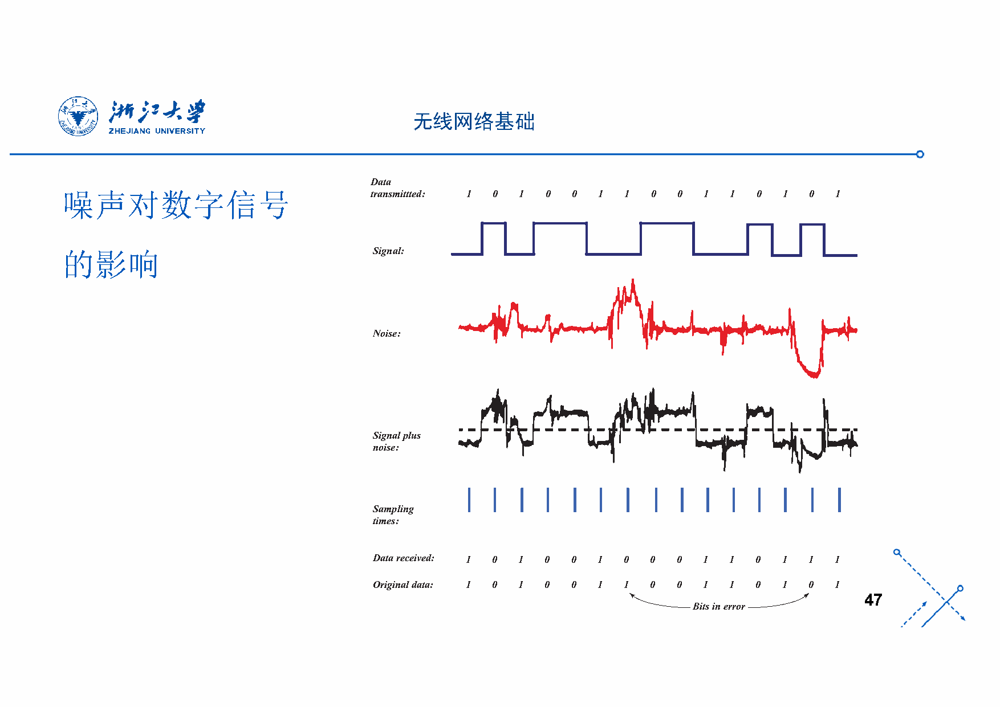

当噪声幅度足够大时，会使接收端在采样时刻的判决错误:

- 应该判为"1"却判成"0"
- 或者应该判为"0"却判成"1"

这种比特错误称为**误码**，误码率（Bit Error Rate， BER）是衡量通信质量的重要指标。

#### 信噪比 (page 48)

> [!definition]+ 信噪比（SNR， Signal-to-Noise Ratio）
>
> 信噪比是信号功率与噪声功率的比值，通常用分贝（dB）表示:
>
> $$
> \text{SNR}_{\text{dB}} = 10 \log_{10} \left(\frac{P_{\text{signal}}}{P_{\text{noise}}}\right)
> $$
>
> 其中:
> - $P_{\text{signal}}$ 是信号功率
> - $P_{\text{noise}}$ 是噪声功率

**SNR 的意义**:

- **高 SNR**:信号远强于噪声，传输质量高，所需中继器数量少
- **低 SNR**:噪声接近或超过信号，误码率高，可能无法正常通信

> [!extra]- **SNR 的影响因素**:信噪比在传输中的特定点（通常在接收器处）测量，受多种因素影响:
> 
> 1. **发射功率**:发射功率越大，接收信号越强
> 2. **传播距离**:距离越远，信号衰减越严重
> 3. **路径损耗**:自由空间损耗、建筑物穿透损耗等
> 4. **环境噪声**:
>     - 白噪声（热噪声）:由电子器件热运动产生
>     - 瞬时干扰:其他电子设备产生的脉冲噪声
>     - 其他发射器的干扰:同频或邻频干扰
> 5. **接收机噪声**:LNA 和后续电路引入的噪声

**SNR 决定可达到的数据速率上限**:

在给定的带宽下，SNR 越高，可以使用更复杂的调制方式（如高阶 QAM），从而实现更高的数据速率。但 SNR 过低时，即使采用最简单的调制方式，误码率也会很高。

#### Shannon 容量定理:有噪声信道容量 (page 49)

在实际通信环境中，信道总是存在噪声。Shannon（克劳德·香农）在 1948 年提出了考虑噪声影响的信道容量公式:

$$
C = B \log_2 \left(1 + \frac{S}{N}\right)
$$

其中:
- $C$ 是信道容量（bps）
- $B$ 是信道带宽（Hz）
- $S/N$ 是信噪比（线性值，非 dB）

**公式的深刻含义**:

1. **信道容量的理论极限**:

这个公式给出了在给定带宽 $B$ 和信噪比 $S/N$ 条件下，可靠传输的理论最大速率。无论采用何种调制和编码技术，都无法超越这个极限。

2. **可达性**:

Shannon 证明:当传输速率 $R < C$ 时，存在某种编码方式，使得误码率可以任意小（趋近于零）。当 $R > C$ 时，无论采用何种编码，误码率都不能任意小。

3. **带宽与信噪比的权衡**:

可以通过两种方式提高容量:
- **增加带宽 $B$**:容量线性增加
- **提高信噪比 $S/N$**:容量以对数方式增加

由于对数函数增长缓慢，提高 SNR 对容量的改善有限。例如:
- SNR 从 1 增加到 3（提高 3 倍）:容量从 $B \log_2 2 = B$ 增加到 $B \log_2 4 = 2B$（翻倍）
- SNR 从 3 增加到 7（再提高 2.33 倍）:容量从 $2B$ 增加到 $B \log_2 8 = 3B$（仅增加 50%）

因此，在 SNR 较高时，继续提高 SNR 的收益递减，不如增加带宽更有效。

4. **实际速率低于理论极限**:

公式给出的 $C$ 是理论最大值，实际系统的数据速率要低得多，因为:
- 公式只假设白噪声（热噪声）
- 没有考虑脉冲噪声、多径衰落、干扰等实际因素
- 实际编码和调制技术离 Shannon 极限还有差距（虽然 Turbo 码、LDPC 码已非常接近）

> [!extra]- Shannon 极限的意义
>
> Shannon 容量定理是信息论的基石，为通信系统设计指明了理论极限和努力方向。几十年来，无数研究者致力于设计更先进的编码和调制技术，以逼近 Shannon 极限。
>
> 现代 5G 系统采用的极化码（Polar Code）、LDPC 码等先进编码技术，已经能够在实际应用中非常接近 Shannon 极限，将理论转化为现实。

#### 应对环境干扰的设计策略 (page 50-51)

信噪比受环境因素影响，包括白噪声、瞬时干扰、传播损耗、障碍物等。那么应该如何应对环境干扰，提高系统容量和可靠性?

**物理层（PHY）设计** (page 50):

1. **调制技术**:
    - 扩频（Spread Spectrum）:将信号能量分散到宽频带，降低干扰影响
    - OFDM（正交频分复用）:将信道分成多个子载波，提高抗频率选择性衰落能力

2. **多路复用技术**:
    - TDMA（时分多址）:不同用户在不同时隙传输
    - FDMA（频分多址）:不同用户使用不同频率
    - CDMA（码分多址）:不同用户使用不同扩频码

3. **天线技术**:
    - MIMO（多输入多输出）:利用多根天线提高容量和可靠性
    - 波束成形（Beamforming）:将信号能量集中在特定方向，提高 SNR

4. **纠错编码（FEC， Forward Error Correction）**:
    - 通过信道编码提高抗误码能力

5. **载波频率选择**:
    - 选择传播特性好、干扰少的频段

6. **信号功率控制**:
    - 根据信道质量动态调整发射功率

**MAC 层与网络层设计** (page 51):

802.11 物理层通过调制、多路复用、天线阵列、编码等技术改善 SNR/SINR（信号与干扰加噪声比）。但仅靠物理层还不够，还需要 MAC 层协同:

- **容纳多个用户**:公平高效地分配信道资源
- **信道访问管理**:CSMA/CA（载波侦听多路访问/冲突避免）避免冲突
- **RTS/CTS 机制**:解决隐藏终端问题
- **功率控制**:降低干扰，延长电池寿命

**网络部署**:

- 测试无线电路径，选择合适的 AP（接入点）位置
- 持续监视网络性能，优化配置

通过物理层、MAC 层和网络规划的综合优化，可以在复杂的无线环境中实现高容量、高可靠性的通信系统。

## 无线信号传播与衰落 (page 52-70)

无线信号在空间传播过程中会受到多种因素的影响，导致信号质量下降。理解这些传播特性和衰落机制，对于设计可靠的无线通信系统至关重要。

### 信号传播特性 (page 52)

#### 传播的基本规律

无线信号在空气中的传播类似于光线，沿直线传播。但与理想的自由空间传播不同，实际环境中的信号传播会受到多种因素的影响:

**路径损耗（Path Loss）** (page 52):

信号功率随传播距离的增加而衰减，这是无线通信中最基本的物理现象。

- **自由空间理论模型**:接收功率与距离平方成反比

$$
P_r \propto \frac{1}{d^2}
$$

- **实际环境模型**:由于大气吸收和各种传播效应，实际衰减更严重

$$
P_r \propto \frac{1}{d^\alpha}
$$

其中 $\alpha$ 通常在 2 到 5 之间，取决于环境特征:

- 自由空间: $\alpha = 2$
- 城市环境: $\alpha = 2.7 \sim 3.5$
- 建筑物内: $\alpha = 4 \sim 6$

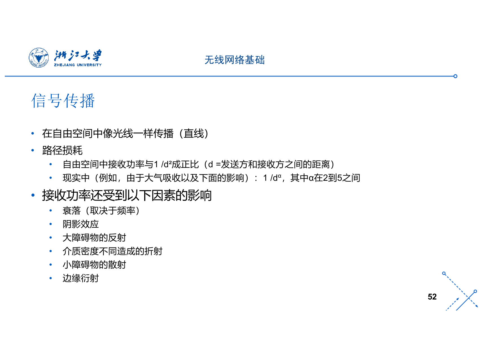

**影响接收功率的因素**:

除了距离导致的路径损耗，接收功率还受到以下因素影响:

1. **衰落（Fading）**:
    - 取决于工作频率
    - 频率越高，衰减越严重
    - 毫米波（如 5G 的 28 GHz）衰减远大于低频段（如 4G 的 2.6 GHz）

2. **阴影效应（Shadowing）**:
    - 大型障碍物（建筑物、山体）的遮挡
    - 造成信号强度的缓慢变化

3. **反射（Reflection）**:
    - 大障碍物（建筑物墙面、地面）表面的镜面反射
    - 改变信号传播方向

4. **折射（Refraction）**:
    - 信号穿过不同介质密度的边界时改变传播方向
    - 例如穿过墙壁、玻璃

5. **散射（Scattering）**:
    - 小障碍物（树叶、路灯、车辆）引起的多方向散射
    - 导致信号能量分散

6. **衍射（Diffraction）**:
    - 信号遇到障碍物边缘时绕过障碍物继续传播
    - 使得非视距（NLOS）区域也能接收到信号

#### 信号传播模式 (page 53)

根据频率和传播距离的不同，无线信号有三种主要传播模式:

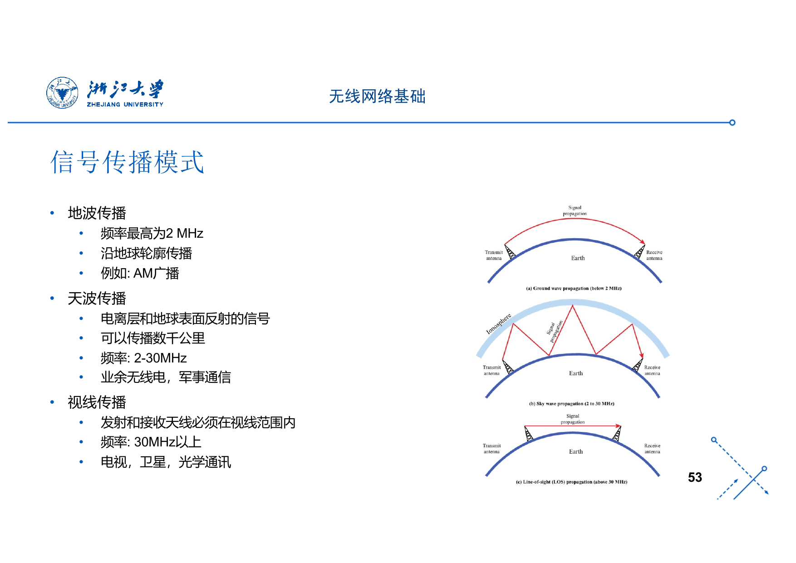

**1. 地波传播（Ground Wave Propagation）**:

- **频率范围**:最高为 2 MHz（极低频到中频）
- **传播特点**:
    - 沿地球表面（地球轮廓）传播
    - 信号贴近地面，绕过障碍物
    - 传播距离可达数百公里
- **典型应用**:
    - AM 中波广播（530-1600 kHz）
    - 长波导航系统
    - 海事通信

**2. 天波传播（Sky Wave Propagation）**:

- **频率范围**:2-30 MHz（短波频段）
- **传播特点**:
    - 信号射向天空，经电离层反射回地面
    - 电离层在白天和夜间高度不同，反射特性变化
    - 可以进行多次反射，实现超远距离传播
    - 传播距离可达数千公里
- **典型应用**:
    - 业余无线电（HAM Radio）
    - 短波国际广播
    - 军事远程通信
    - 远洋船舶通信

**3. 视线传播（Line-of-Sight Propagation）**:

- **频率范围**:30 MHz 以上（超短波、微波、毫米波）
- **传播特点**:
    - 发射和接收天线必须在视线范围内（可视距离）
    - 类似光的直线传播，不能绕过大型障碍物
    - 传播距离受限于地球曲率和天线高度
    - 大气折射可略微扩展视距范围
- **典型应用**:
    - 电视广播（VHF/UHF）
    - 调频广播（FM， 88-108 MHz）
    - 移动通信（GSM 900 MHz， LTE 2.6 GHz， 5G 3.5 GHz）
    - 卫星通信（GHz 频段）
    - 光纤通信（光波频段）

> [!note]+ 为什么现代无线通信多使用高频?
>
> - **更大的带宽**:高频段可分配更宽的频谱，支持更高的数据速率
> - **更小的天线**:天线尺寸与波长成正比，高频允许使用小型天线
> - **更精确的波束**:高频信号的波束更窄，可实现定向传输和空间复用
>
> 但代价是:
> - 穿透能力差，需要视距传播
> - 衰减更严重，覆盖范围小
> - 需要更密集的基站部署

### 信号衰落机制 (page 54-62)

#### 衰落的定义与分类 (page 54)

> [!definition]+ 衰落（Fading）
>
> 由传输介质或路径的变化引起的接收信号功率随时间变化的现象。
>
> - 在固定环境中，衰落主要由大气条件引起（如降雨、雾霾）
> - 在移动环境中，衰落机制更复杂，由多种效应共同作用

**衰落的主要原因**:

1. **自由空间损耗**:距离导致的功率衰减
2. **大气吸收**:空气分子、水蒸气、氧气吸收电磁波能量
3. **多径传播**:反射、散射、衍射、折射导致的多路径干涉
4. **移动性**:发射器或接收器的移动引起的快速衰落和慢衰落
5. **其他发射器的干扰**:同频或邻频干扰

#### 影响信号传播的四大效应 (page 55-59)

无线信号传播受到四个主要物理效应的影响，这些效应共同决定了信号质量和系统性能。

**1. 多径效应（Multipath Effect）** (page 56):

多径效应是无线通信中最重要也最复杂的现象。

**产生机制**:

由于山丘、建筑物等的反射、散射或绕射，终端与基站之间的信号传播途径有多条。接收到的信号是发射信号经过若干次反射、绕射或散射后的叠加:

- 有时因相位相同而加强（建设性干涉）
- 有时因相位相反而减弱（破坏性干涉）

接收信号的幅度因此急剧变化，即产生了**快衰落（Fast Fading）**。

**数学模型**:

多径传播使接收端的信号包络近似于**瑞利分布（Rayleigh Distribution）**，故多径快衰落又称为**瑞利衰落**。

**快衰落的三种类型**:

1. **时间选择性衰落（Time-Selective Fading）**:
    - 由于移动或散射体移动，信道随时间快速变化
    - 典型时间尺度:毫秒级

2. **空间选择性衰落（Space-Selective Fading）**:
    - 不同位置的接收信号强度差异巨大
    - 移动几个波长距离，信号强度可能从峰值跌至谷底
    - 典型空间尺度:半个波长（如 2.4 GHz 时约 6 cm）

3. **频率选择性衰落（Frequency-Selective Fading）**:
    - 信道对不同频率成分的衰落特性不同
    - 宽带信号的不同频率分量经历不同的衰落
    - 导致频谱失真和码间干扰（ISI）

**2. 阴影效应（Shadowing Effect）** (page 57):

**产生机制**:

终端在运动过程中，由于大型建筑物和其他物体对电波传播路径的阻挡，在传播接收区域上形成半盲区，从而形成电磁场阴影。

这种随终端位置不断变化而引起的接收点场强中值的起伏变化，叫做阴影效应。

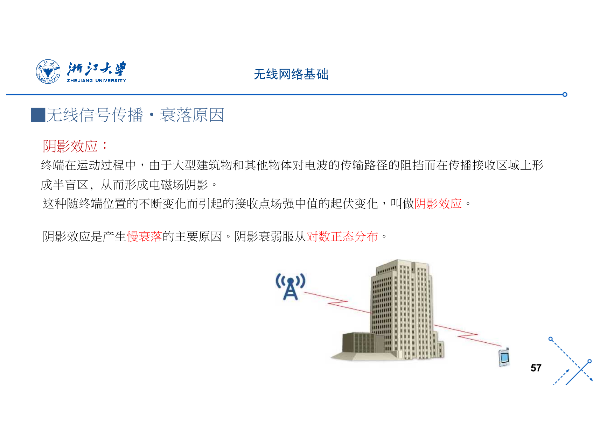

**特点**:

- 阴影效应是产生**慢衰落（Slow Fading）**的主要原因
- 变化尺度:数十米到数百米
- 变化速度:相对缓慢（秒级）
- **统计模型**:阴影衰弱服从**对数正态分布（Log-Normal Distribution）**

**影响**:

- 造成覆盖盲区或信号弱区
- 需要通过网络规划优化基站位置
- 在室内环境尤为明显

**3. 远近效应（Near-Far Effect）** (page 58):

**产生机制**:

手机用户在一个小区内是随机分布的，且位置经常变化:
- 有时处在小区边缘（距基站远）
- 有时靠近基站（距基站近）

如果所有手机的发射功率都按照最大通信距离设计，则:
- 当手机靠近基站时，功率过剩
- 对远距离信号较弱的用户形成强干扰

这种近站用户"以强压弱"，对远站用户造成影响甚至通信中断的现象，称为**远近效应**。

**影响与解决**:

- 远近效应在 **CDMA 网络**中极其明显
    - CDMA 中所有用户共享相同频率，靠码字区分
    - 近端用户的强信号会"淹没"远端用户的弱信号
- **解决方法**:采用**功率控制技术（Power Control）** 进行平衡
    - 基站动态调整各手机的发射功率
    - 距离近的手机降低功率
    - 距离远的手机提高功率
    - 确保基站接收到的各用户信号强度相近

**4. 多普勒效应（Doppler Effect）** (page 59):

**产生机制**:

当波源和接收者相对运动时，接收的频率和波源的频率不同，产生**频移（Frequency Shift）**:

- 两者相互接近时，接收到的频率升高（正频移）
- 两者相互远离时，接收到的频率降低（负频移）

这就是多普勒效应。

**频移公式**:

多普勒频移量 $f_d$ 与以下因素有关:

$$
f_d = \frac{v}{\lambda} \cos\theta = \frac{v \cdot f_c}{c} \cos\theta
$$

其中:
- $v$ 是接收者的移动速度
- $\lambda$ 是工作波长
- $f_c$ 是载波频率
- $c$ 是光速
- $\theta$ 是波的到达角度（相对于移动方向）

**影响**:

- 造成频率偏移，解调时需要补偿
- 高速移动时（如高铁）多普勒频移可达数百 Hz
- 引起信道快速时变，增加信号处理难度

> [!example]+ 多普勒频移计算示例
>
> 假设:
> - 载波频率 $f_c = 2.4$ GHz
> - 车速 $v = 120$ km/h = 33.3 m/s
> - 正面接近（$\theta = 0°$，$\cos\theta = 1$）
>
> 频移:
> $$
> f_d = \frac{33.3 \times 2.4 \times 10^9}{3 \times 10^8} = 267 \text{ Hz}
> $$
>
> 这个频移足以影响窄带信号的解调。

#### 无线信号的三大损耗 (page 55)

从损耗的角度，无线信号传播面临三大类损耗:

1. **多径损耗（Multipath Loss）**:
    - 多径干涉导致的信号衰落
    - 快速变化，难以预测
    - 需要通过分集、均衡等技术对抗

2. **传播损耗（Propagation Loss）**:
    - 距离导致的路径损耗
    - 可以通过链路预算计算
    - 通过增加发射功率或减小基站间距补偿

3. **穿透损耗（Penetration Loss）**:
    - 信号穿透建筑材料时的能量损失
    - 取决于材质和频率
    - 下面详细介绍

#### 穿透损耗 (page 62)

无线信号穿透不同材料时会产生额外的衰减。穿透损耗主要受两个因素影响:

1. **材质**:不同材料的电磁特性差异巨大
2. **频率**:频率越高，损耗越大

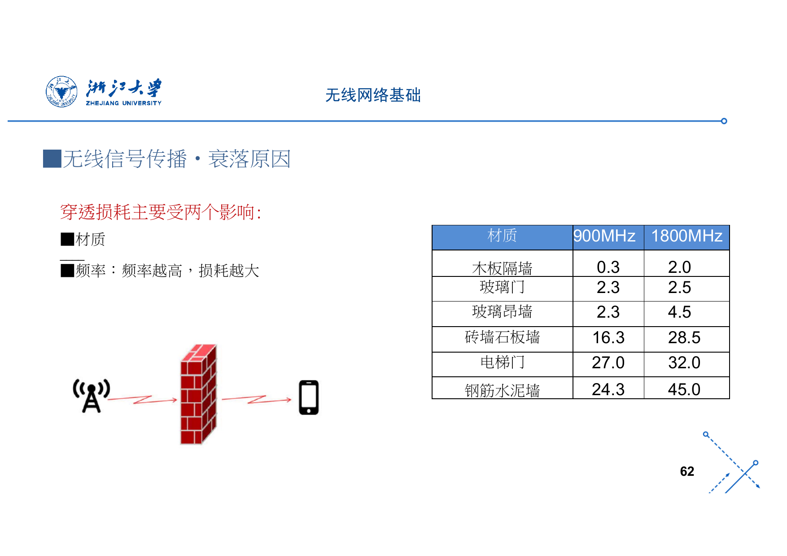

**常见建筑材料的穿透损耗**:

| 材料类型 | 900 MHz 损耗 (dB) | 1800 MHz 损耗 (dB) |
|:---:|:---:|:---:|
| 木板隔墙 | 0.3 | 2.0 |
| 玻璃门 | 2.3 | 2.5 |
| 玻璃砖墙 | 2.3 | 4.5 |
| 砖墙/石板墙 | 16.3 | 28.5 |
| 电梯门 | 27.0 | 32.0 |
| 钢筋水泥墙 | 24.3 | 45.0 |

**关键观察**:

- **轻质材料**（木板、玻璃）穿透损耗较小，约 0.3-4.5 dB
- **重质材料**（砖墙、混凝土）穿透损耗很大，可达 16-45 dB
- **金属结构**（电梯、钢筋）几乎完全阻挡信号，损耗 27-32 dB
- **频率依赖性**:1800 MHz 的损耗明显大于 900 MHz

**设计影响**:

- **室内覆盖**:需要考虑建筑材料的穿透损耗，规划室内分布系统
- **高频段挑战**:5G 毫米波（28 GHz）穿透能力极差，几乎无法穿透墙壁
    - 需要在每个房间部署小基站
    - 或者使用中低频段提供基础覆盖
- **特殊场景**:电梯、地下室、停车场等场景需要专门的覆盖方案

#### 移动性对衰落的影响 (page 60)

当用户在移动时，信号传播路径会不断变化，引起两种不同时间尺度的衰落。

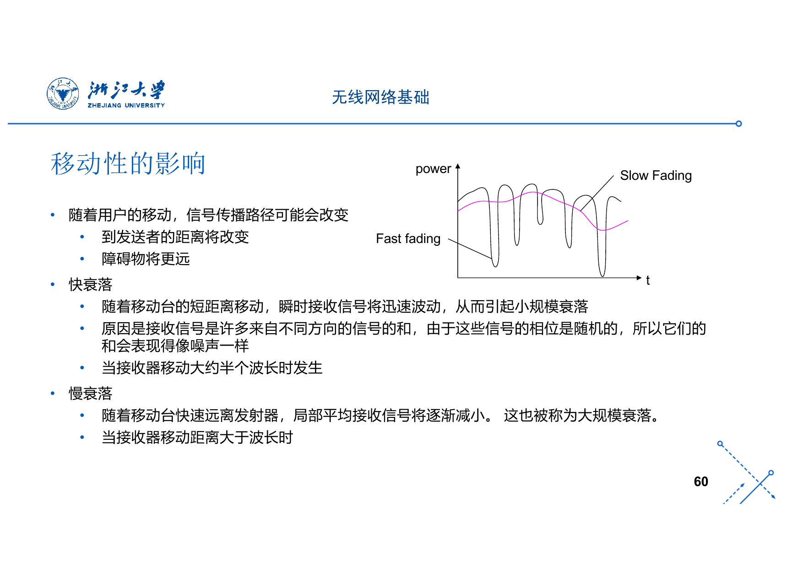

**快衰落（Fast Fading）**:

- **变化尺度**:随着移动台的短距离移动（约半个波长），瞬时接收信号迅速波动
- **产生原因**:接收信号是许多来自不同方向的信号的和，由于这些信号的相位是随机的，它们的和表现得像噪声一样
- **典型时间**:毫秒级
- **典型距离**:几厘米到几十厘米（取决于载波频率）
- **对应物理机制**:多径效应引起的小尺度衰落

**慢衰落（Slow Fading）**:

- **变化尺度**:随着移动台远离发射器，局部平均接收信号逐渐减小
- **产生原因**:路径损耗和阴影效应
- **典型时间**:秒级到分钟级
- **典型距离**:数十米到数百米
- **对应物理机制**:大尺度衰落

**信号强度与距离的关系** (page 61):

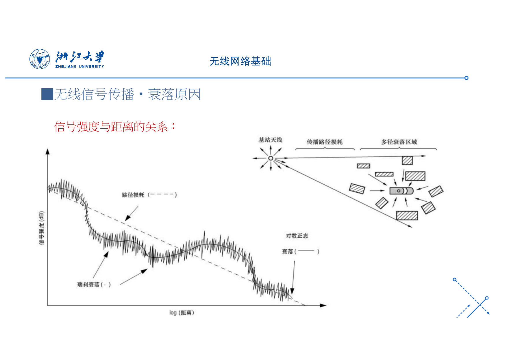

从图中可以看出:
- **整体趋势**:信号强度随距离增加而下降（慢衰落）
- **局部波动**:在短距离内信号强度剧烈起伏（快衰落）
- **三个区域**:
  1. **近场区**:靠近基站，信号强且稳定
  2. **过渡区**:慢衰落主导，信号逐渐减弱
  3. **远场区**:快衰落明显，信号强度在均值附近剧烈波动

### 抗衰落技术 (page 63-66)

为了对抗无线信道的各种衰落，现代通信系统采用多种技术手段。这些技术从不同角度提高系统的可靠性和鲁棒性。

#### 三大类抗衰落技术概览 (page 63)

目前主要的抗衰落技术包括:

1. **分集技术（Diversity）**:补偿衰落信道损耗
2. **信道编码技术（Channel Coding）**:检错、纠错
3. **均衡技术（Equalization）**:消除码间干扰

这三种技术从不同维度对抗衰落:
- 分集技术利用信号的多个独立副本
- 信道编码增加冗余提高抗误码能力
- 均衡技术补偿信道失真

#### 分集技术（Diversity） (page 64)

分集技术是对抗衰落最有效的方法之一。

> [!definition]+ 分集接收
>
> 在接收端分散接收几个衰落情况不同（相互统计独立）的合成信号，再以一定的方式将它们合并集中，使总接收信号的信噪比得到改善，衰落的影响减小。

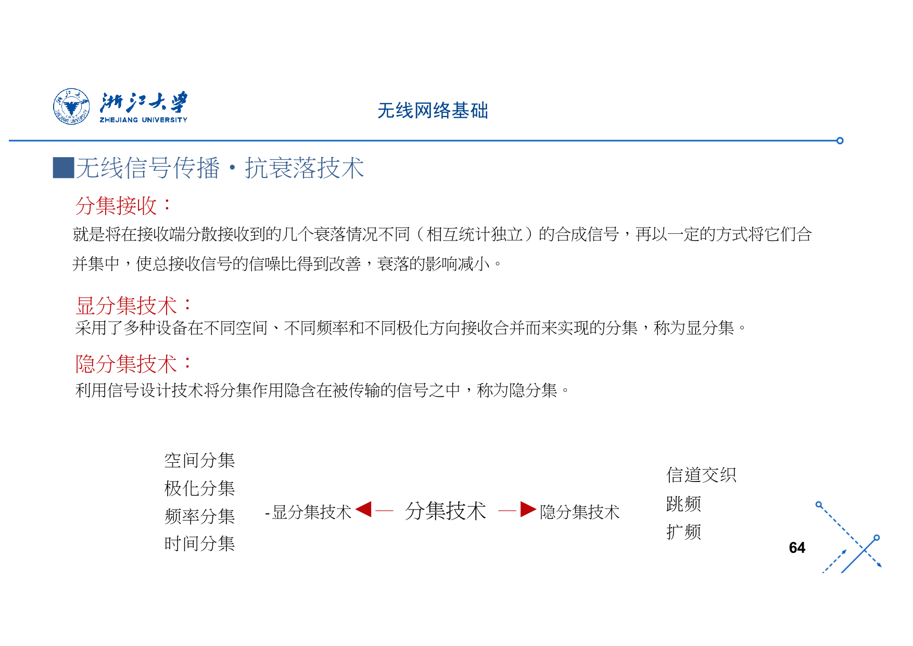

**分集技术的分类**:

根据实现方式，分集技术可分为两大类:

**1. 显分集技术（Explicit Diversity）**:

采用了多种设备在不同空间、不同频率和不同极化方向接收合并而来实现的分集。

- **空间分集（Space Diversity）**:
    - 使用多根天线，利用空间位置差异
    - **发送分集**:多根发送天线
    - **接收分集**:多根接收天线
    - 天线间距通常为半个波长以上，确保接收信号独立衰落
    - 例如:MIMO 系统使用多根天线实现空间分集

- **频率分集（Frequency Diversity）**:
    - 在不同频率上传输相同信息
    - 利用频率选择性衰落特性:不同频率经历独立的衰落
    - 频率间隔需大于相干带宽（通常几 MHz）
    - 例如:OFDM 在多个子载波上传输

- **时间分集（Time Diversity）**:
    - 在不同时刻重复传输相同信息
    - 利用时变信道特性:不同时刻的衰落独立
    - 时间间隔需大于信道相干时间（通常几毫秒到几十毫秒）
    - 例如:重传机制（ARQ）

- **极化分集（Polarization Diversity）**:
    - 使用不同极化方向的天线
    - 水平极化和垂直极化信号独立衰落
    - 天线尺寸小，适合移动终端

**2. 隐分集技术（Implicit Diversity）**:

利用信号设计技术将分集作用隐含在被传输的信号之中。

- **信道交织（Channel Interleaving）**:
    - 将连续的编码符号打散，使突发错误分散为随机错误
    - 提高纠错码的有效性
    - 详见下一小节

- **跳频（Frequency Hopping）**:
    - 载波频率按伪随机序列快速跳变
    - 实现时间和频率的隐式分集
    - 例如:蓝牙的自适应跳频

- **扩频（Spread Spectrum）**:
    - 将信号能量分散到宽频带
    - 频率分集的一种形式
    - 例如:CDMA 的直接序列扩频

**分集增益**:

分集技术可以显著降低深衰落的概率。如果有 $N$ 个独立的分集支路:

- **概率改善**:深衰落概率从 $P$ 降低到约 $P^N$
- **信噪比改善**:可获得约 $10\log_{10}N$ dB 的分集增益
- **可靠性提升**:$N=2$ 时已有明显改善，$N=4$ 时效果显著

#### 信道交织技术（Interleaving） (page 65)

交织技术通过打散连续的编码符号，将突发错误分散为随机错误，提高纠错码的有效性。

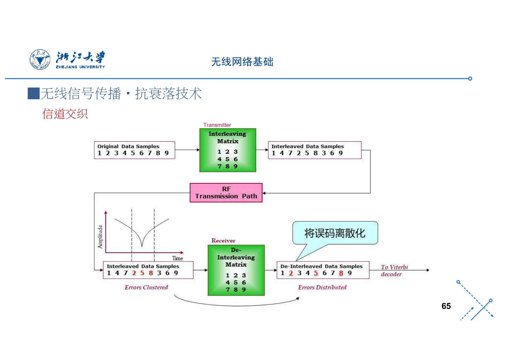

**交织过程**:

1. **发送端交织器（Interleaver）**:
    - 将编码后的比特按**行**写入交织矩阵（$R$ 行 $C$ 列）
    - 按**列**读出并发送
    - 相邻的编码比特被分散到不同的时刻发送

2. **信道传输**:
    - 如果某一时刻发生深衰落，会导致连续的 $L$ 个符号错误

3. **接收端解交织器（Deinterleaver）**:
    - 按**列**写入解交织矩阵
    - 按**行**读出恢复原始顺序
    - 连续的 $L$ 个错误分散到 $L$ 个不同的码字中

**效果**:

假设:
- 交织矩阵大小为 $5 \times 10$（5 行 10 列）
- 纠错码能纠正每个码字中最多 1 个错误
- 传输过程中发生连续 5 个符号的突发错误

**无交织时**:
```
码字1: X X X X X (5个错误，无法纠正)
码字2: ✓ ✓ ✓ ✓ ✓ (无错误)
码字3: ✓ ✓ ✓ ✓ ✓ (无错误)
...
```

**有交织时**:
```
码字1: X ✓ ✓ ✓ ✓ (1个错误，可纠正)
码字2: ✓ X ✓ ✓ ✓ (1个错误，可纠正)
码字3: ✓ ✓ X ✓ ✓ (1个错误，可纠正)
码字4: ✓ ✓ ✓ X ✓ (1个错误，可纠正)
码字5: ✓ ✓ ✓ ✓ X (1个错误，可纠正)
```

交织后，原本无法纠正的突发错误变成了可以纠正的随机错误！

**交织深度**:

- **定义**:交织矩阵的大小（行数×列数）称为交织深度
- **深度越大**:
    - 抗突发错误能力越强
    - 但会引入更大的处理时延
    - 需要更多的缓存

- **实际应用**:
    - GSM:交织深度为 8 个 TDMA 帧（约 40 ms）
    - LTE:交织深度可调，根据信道条件动态选择
    - 实时语音通信:时延要求高，交织深度较小
    - 数据传输:可容忍较大时延，交织深度较大

> [!note]+ 交织与纠错码的配合
>
> 交织技术本身不增加冗余，不能纠正错误。它的作用是:
> - 将信道的突发错误特性转换为随机错误
> - 使纠错码能够发挥最大效能
>
> 因此，交织通常与纠错码（如卷积码、Turbo 码）配合使用:
> 编码 → 交织 → 调制 → 信道 → 解调 → 解交织 → 译码

#### 均衡技术（Equalization） (page 66)

均衡技术用于补偿信道的频率选择性衰落和时延扩展，消除符号间干扰（ISI）。

> [!definition]+ 均衡
>
> 均衡是指对信道特性进行补偿，即接收端均衡器产生与信道相反的特性，用来抵消信道的时变多径传播特性引起的码间干扰。

**均衡的基本思想**:

信道可以看作一个滤波器 $H(f)$，它会引起:
- 幅度失真:不同频率的信号衰减不同
- 相位失真:不同频率的信号延迟不同
- 时延扩展:多径导致符号展宽，产生 ISI

均衡器设计一个滤波器 $G(f)$，使得:

$$
H(f) \times G(f) \approx 1
$$

即信道和均衡器的级联响应接近理想特性，从而补偿信道失真。

### 无线通信的特点与挑战 (page 67)

总结无线通信的本质特征和面临的主要挑战:

**无线通信的本质特征**:

1. **必须使用无线电波**:
    - 通过电磁波在空间传播信息
    - 不需要物理连接，支持移动性

2. **传播环境复杂**:
    - 噪声和干扰无处不在
    - 多径传播导致衰落
    - 信道时变，难以预测
    - 受天气、建筑物、地形等多种因素影响

3. **移动性要求高**:
    - 设备需要支持移动中通信
    - 需要处理多普勒效应
    - 切换（Handover）机制保证连续性
    - 功耗受限，电池容量有限

4. **频谱资源稀缺**:
    - 频谱是有限且宝贵的公共资源
    - 需要政府监管和授权
    - 用户需求持续增长
    - **频谱效率**成为核心设计目标

**设计挑战**:

从这些特征衍生出无线系统设计的核心挑战:

- **容量与覆盖的矛盾**:
    - 提高容量需要增加带宽或信噪比
    - 扩大覆盖需要降低频率或增加发射功率
    - 频谱和功率都受到限制

- **移动性与可靠性的矛盾**:
    - 高速移动导致快衰落和多普勒频移
    - 保持服务质量需要更多的资源和复杂的信号处理

- **多用户公平性**:
    - 在多用户场景下公平高效地分配资源
    - 避免远近效应等不公平现象

- **功耗与性能的权衡**:
    - 移动设备电池容量有限
    - 复杂的信号处理和高发射功率都会增加功耗

**应对策略**:

- 在有限的功率、带宽、复杂度约束下，最大化系统容量和可靠性
- 综合运用物理层技术（调制、编码、分集、均衡）
- 结合 MAC 层和网络层的优化（多址、功率控制、资源调度）
- 通过网络规划和优化提高频谱效率

## 多址接入技术 (page 68-90)

### 复用与多址的概念 (page 68-69)

#### 基本定义

> [!definition]+ 复用与多址
>
> **复用（Multiplexing）**:
> - 将来自多个源的信息流组合起来通过一个共享介质进行传输的技术
> - 在发送端进行复用（Multiplexing）
> - 在接收端进行解复用（Demultiplexing），将组合信息恢复回单独的信息流
>
> **多址（Multiple Access）**:
> - 在无线通信系统中，多个用户共享信道资源的方法
> - 多址技术决定了如何在时间、频率、空间、码域等维度上分配资源

**复用的必要性**:

- 通信资源（频谱、时间、功率）是稀缺的
- 多个用户需要同时使用系统
- 通过复用技术提高资源利用率
- 降低系统成本，提高经济效益

#### 四个维度的多路复用 (page 69)

现代无线通信系统可以在四个正交维度上实现多路复用:

1. **频率（f， Frequency）**:
    - 将整个频谱分成若干个子频带；
    - 每一个信道可以在整个传输过程中始终占用某个子频带
    - 频分复用（FDM）和频分多址（FDMA）
2. **时间（t， Time）**:
    - 将时间划分为多个时隙
    - 不同用户或信息流占用不同时隙
    - 时分复用（TDM）和时分多址（TDMA）
3. **空间（s， Space）**:
    - 利用空间位置或波束方向
    - 不同用户或信息流使用不同的天线或波束
    - 空分复用（SDM）和空分多址（SDMA）
4. **编码（c， Code）**:
    - 利用正交或准正交的码字
    - 不同用户或信息流使用不同的扩频码
    - 码分复用（CDM）和码分多址（CDMA）

这四个维度可以组合使用，实现更高效的资源利用。

### 频分复用与频分多址 (page 70)

#### FDM/FDMA 原理

频分复用（FDM）将可用频谱划分为多个子频带，每个信道占用一个子频带进行传输。

**基本特征**:

- 多个信道在**频率域**上分隔
- 每个信道在**整个时间**内持续占用其分配的频带
- 信道 1， 2， 3， ...， k 占用不同的频率范围
- 需要**保护频带（Guard Band）**防止相邻信道干扰

**优点**:

1. **无需动态协调**:
    - 频率分配是静态的，无需复杂的调度
    - 实现简单，硬件成本低

2. **适用于模拟信号**:
    - 可以直接传输模拟信号
    - 早期模拟通信系统（AM/FM 广播）的基础技术

3. **各信道互不影响**:
    - 频域分离，一个信道的问题不会影响其他信道

**缺点**:

1. **频谱利用率低**:
    - 需要保护频带，造成频谱浪费
    - 如果某个信道流量低，其频谱也无法被其他信道使用

2. **灵活性差**:
    - 频率分配固定，难以动态调整
    - 无法适应流量的时变特性

3. **保护频带开销**:
    - 相邻信道需要足够的频率间隔防止干扰
    - 保护频带不传输有用信息

**典型应用**:

- **模拟广播**:AM 广播、FM 广播、模拟电视
- **有线电视**:CATV 系统中的多频道传输
- **第一代移动通信**:AMPS（高级移动电话系统）

### 时分复用与时分多址 (page 71)

#### TDM/TDMA 原理

时分复用（TDM）将时间划分为多个时隙，一个信道可以在一定时间内获得整个频谱的带宽。

**基本特征**:

- 多个信道在**时间域**上分隔
- 每个信道在**整个频谱**上传输，但只在分配的时隙内
- 时隙周期性重复，形成帧结构
- 各信道按固定顺序轮流占用信道

**优点**:

1. **任何时候介质中只有一个载波**:
    - 不存在多个载波同时传输造成的非线性失真
    - 功率放大器可以工作在饱和区，效率高
2. **大量用户条件下也能保证高吞吐量**:
    - 时隙可以动态分配给活跃用户
    - 空闲用户的时隙可以分配给其他用户
3. **适合突发数据传输**:
    - 数据可以在分配的时隙内高速传输
    - 无需连续占用信道

**缺点**:

1. **需要精确的同步**:
    - 所有用户必须在时间上严格对齐
    - 同步开销较大
    - 对时钟精度要求高
2. **保护时间开销**:
    - 时隙之间需要保护间隔（Guard Time）
    - 防止时隙重叠
3. **时延**:
    - 用户需要等待自己的时隙到来才能发送
    - 对实时性要求高的应用不利

**典型应用**:

- **2G 移动通信**:GSM 系统
- **卫星通信**:多个地面站共享卫星转发器
- **数字电话**:T1/E1 时分复用系统

### 时分频分复用 (page 72)

#### TDMA/FDMA 组合

时分频分复用是时分复用和频分复用两种方法的组合，一个用户获得一定时间内的一定频段。

**基本特征**:

- 在**频率**和**时间**两个维度上同时划分资源
- 用户占用特定频带的特定时隙
- 形成二维资源网格

**优点**:

1. **防止频率选择性干扰**:
    - 如果某个频段受到干扰，只影响该频段上的用户
    - 其他频段的用户不受影响

2. **更好的防窃听保护**:
    - 用户信号在时频域上都是分散的
    - 窃听者需要同时在正确的时间和频率上监听

3. **灵活的资源分配**:
    - 可以根据用户需求动态分配时隙和频率
    - 支持不同的服务质量（QoS）要求

**缺点**:

- **需要精确的协调**:
    - 时间和频率上都需要同步
    - 控制信令开销较大

- **复杂度增加**:
    - 需要更复杂的调度算法
    - 硬件实现成本较高

**典型应用**:

- **GSM 系统**:
    - 频率:200 kHz 信道间隔
    - 时间:每个载波划分为 8 个时隙
    - 每个用户占用一个载波的一个时隙

### 码分复用与码分多址 (page 73-75)

#### CDM/CDMA 原理

码分复用（CDM）常用于蜂窝电话系统和卫星通信。手机中使用的特殊码分复用称为**码分多址（CDMA）**。

**核心思想**:

- 所有信道在**同一时间**使用**相同的频谱**
- 依靠正交向量空间中的数学原理
- 正交向量可以组合和分离而不会产生干扰

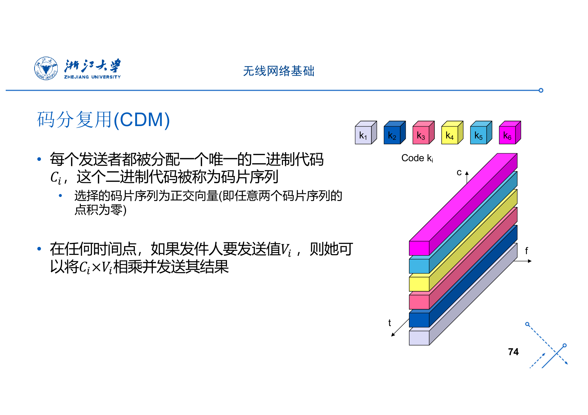

#### CDMA 的数学基础 (page 74)

**码片序列（Chip Sequence）**:

每个发送者被分配一个唯一的二进制代码 $C_i$，称为码片序列。

**正交性要求**:

选择的码片序列必须是**正交向量**，即任意两个码片序列的**内积（点积）为零**:

$$
C_i \cdot C_j = 0，\quad \forall i \neq j
$$

**编码与传输**:

如果发送者 $i$ 要发送数据值 $V_i$（+1 表示比特 1，-1 表示比特 0），则:

1. 将 $C_i \times V_i$ 相乘，得到发送信号
2. 发送结果信号

**接收与解码**:

接收端接收到所有用户信号的叠加:

$$
S = \sum_{i=1}^{N} C_i \times V_i
$$

要恢复用户 $j$ 的数据，将接收信号与 $C_j$ 做内积:

$$
S \cdot C_j = \left(\sum_{i=1}^{N} C_i \times V_i\right) \cdot C_j = V_j \times (C_j \cdot C_j) = V_j \times |C_j|^2
$$

由于其他用户的码字与 $C_j$ 正交，内积为零，因此只恢复出用户 $j$ 的数据。

> [!example]- CDMA 编解码示例
>
> 假设有 3 个用户，码片序列为:
> - 用户 1: $C_1 = [+1， +1， +1， +1]$
> - 用户 2: $C_2 = [+1， +1， -1， -1]$
> - 用户 3: $C_3 = [+1， -1， +1， -1]$
>
> 可以验证这些码字两两正交。
>
> **发送**:
> - 用户 1 发送比特 1 ($V_1 = +1$):$S_1 = [+1， +1， +1， +1]$
> - 用户 2 发送比特 0 ($V_2 = -1$):$S_2 = [-1， -1， +1， +1]$
> - 用户 3 发送比特 1 ($V_3 = +1$):$S_3 = [+1， -1， +1， -1]$
>
> **信道中的合成信号**:
> $$
> S = S_1 + S_2 + S_3 = [+1， -1， +3， +1]
> $$
>
> **接收**（恢复用户 2 的数据）:
> $$
> S \cdot C_2 = (+1)(+1) + (-1)(+1) + (+3)(-1) + (+1)(-1) = 1 - 1 - 3 - 1 = -4
> $$
>
> 归一化:$V_2 = -4 / 4 = -1$，即比特 0，恢复成功！

#### CDMA 的优缺点 (page 75)

**优点**:

1. **带宽高效**:
    - 所有用户共享全部频谱
    - 频谱利用率高
2. **无需协调和同步**:
    - 用户可以随时发送
    - 无需时隙分配和频率分配
3. **良好的抗干扰和防窃听功能**:
    - 信号被扩频，功率密度低
    - 未授权用户没有码字，无法解码
    - 窄带干扰只影响扩频信号的一小部分
4. **软容量**:
    - 可以容纳更多用户，代价是信噪比下降
    - 系统容量可以根据服务质量要求灵活调整
5. **多径抗性**:
    - 通过 Rake 接收机可以利用多径分量
    - 将多径干扰转化为分集增益

**缺点**:

1. **更复杂的信号再生**:
    - 需要精确的功率控制
    - 远近效应严重，必须补偿
    - 接收机复杂度高

**典型应用**:

- **3G 移动通信**:WCDMA（联通）、CDMA2000（电信）、TD-SCDMA（移动）
- **GPS**:全球定位系统使用 CDMA 区分卫星
- **军事通信**:抗干扰和保密通信

### 扩频技术 (page 76-83)

#### 扩频的动机 (page 76)

**问题**:

经过前面介绍的调制技术（AM、FM、PSK、QAM）后得到的信号带宽还很窄，存在以下问题:

- 窄带信号容易受到干扰
- 频率选择性衰落或窄带噪声会消除整个信号
- 难以在多用户环境中共享频谱

**解决方案**:

使用特殊编码将窄带信号扩展为宽带信号:
- 信号能量分散到宽频带上
- 单频干扰或窄带噪声只影响一小部分频谱
- 系统仍能正常工作

#### 扩频基础 (page 77)

**基本原理**:

输入数据使用**扩展码（Spreading Code）** 进行调制，也称为**扩展序列（Spreading Sequence）**。

**扩频技术的主要类型**:

1. **跳频扩频（FHSS， Frequency Hopping Spread Spectrum）**
2. **直接序列扩频（DSSS， Direct Sequence Spread Spectrum）**

两种技术的共同特点:
- 发送信号的带宽远大于信息带宽
- 接收端需要知道扩展码才能解扩

#### 跳频扩频（FHSS） (page 78-79)

**工作原理**:

信号通过一系列看似随机的射频频率进行广播:

- 信号以固定的间隔从一个频率**跳**到另一个频率
- 在每个连续的间隔，都会选择一个新的载波频率
- 发射器一次在一个信道中运行
- 跳频序列由伪随机码决定

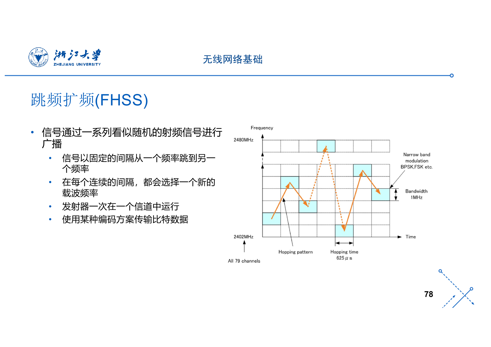

**关键参数**:

- **跳频速率**:每秒跳变的次数
    - 快跳频:每个数据符号跳变多次
    - 慢跳频:一个跳频持续时间内传输多个数据符号

- **跳频带宽**:所有可能跳频的总频率范围
    - 例如:蓝牙使用 2.4 GHz ISM 频段，划分为 79 个信道，每个信道 1 MHz

**优点**:

1. **对窄带干扰具有很高的抵抗力**:
    - 攻击者需要干扰所有频段才能阻断通信
    - 即使部分频段受干扰，其他频段仍可正常工作

2. **对窄带窃听者来说信号可能只表现为背景噪音**:
    - 未授权接收者在单个频点上只能接收到短暂的信号片段
    - 难以解调和窃听

3. **多用户共享**:
    - 不同用户使用不同的跳频序列
    - 偶尔发生碰撞时只影响少量数据

**缺点**:

1. **同步问题**:
    - 发送和接收必须精确同步
    - 同步建立和维护复杂

2. **频率切换开销**:
    - 每次跳频需要时间稳定
    - 降低有效吞吐量

3. **频率合成器要求高**:
    - 需要快速频率切换能力
    - 硬件成本较高

**典型应用**:

- **蓝牙（Bluetooth）**:使用自适应跳频，每秒跳频 1600 次
- **早期 WiFi**:IEEE 802.11 最初支持 FHSS（现已淘汰）
- **军事通信**:抗干扰和保密通信

#### 直接序列扩频（DSSS） (page 80-81)

**工作原理**:

使用扩展码将信号扩展到更宽的频带:

1. 每个数据比特被扩展为一串高速率的**码片（Chip）**
2. 使用**异或（XOR）**运算将数字数据流与扩展码比特流结合
3. 扩展后的信号调制到载波上发送

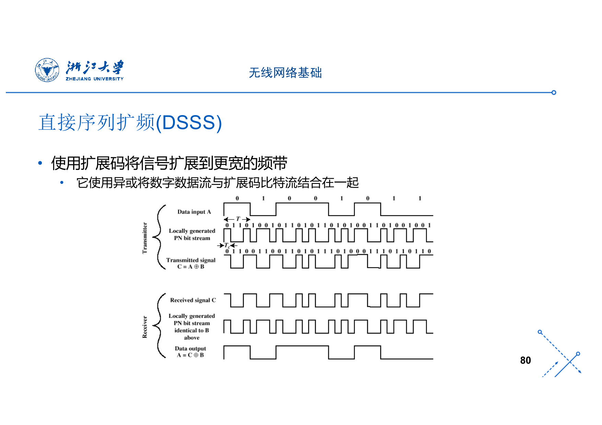

**扩频过程**:

假设:
- 数据速率:1 Mbps
- 扩展码速率（码片速率）:11 Mcps（mega chips per second）
- 扩频增益:11 倍

每个数据比特被扩展为 11 个码片:

```
数据比特:     1           0           1
              |           |           |
扩展码:   +1 -1 +1 +1 -1 -1 +1...
              |           |           |
扩频信号: +1 -1 +1 +1 -1 ... (异或运算)
```

**解扩过程**:

接收端用相同的扩展码与接收信号做相关运算:

- 如果码字匹配，相关峰值出现，恢复出数据比特
- 如果码字不匹配，相关值接近零，信号被抑制

**优点**:

1. **减少频率选择性衰落**:
    - 信号占用宽频带
    - 即使部分频率衰落严重，其他频率仍能贡献能量

2. **在蜂窝网络中的优势**:
    - 基站可以使用相同的频率范围
    - 几个基站可以同时检测并恢复信号
    - 支持**软切换（Soft Handover）**:
      - 移动台同时与多个基站通信
      - 切换过程平滑，不中断通信

3. **抗窄带干扰**:
    - 窄带干扰经解扩后被扩展到宽带
    - 对每个数据比特的影响很小

4. **多径抗性**:
    - 通过 Rake 接收机可以分离并合并多径分量
    - 将多径干扰转化为分集增益

**缺点**:

1. **需要精确的功率控制**:
    - 远近效应严重
    - 近端用户的强信号会"淹没"远端用户
    - 必须通过功率控制使基站接收到的各用户信号强度相近

2. **对多径时延扩展敏感**:
    - DSSS 使用非常高的传输速率 ⇒ 非常短的码元
    - 对回声和延迟特别敏感
    - 多径时延可能导致码片重叠

**典型应用**:

- **早期 WiFi**:IEEE 802.11b 使用 DSSS，数据速率最高 11 Mbps
- **3G CDMA**:WCDMA、CDMA2000 基于 DSSS
- **GPS**:全球定位系统

#### FHSS vs DSSS 对比 (page 82)

| 特性 | FHSS | DSSS |
|:---:|:---|:---|
| **吞吐量** | 花时间重新同步和跳频（FSK），吞吐量略低 | 可以连续传输（PSK），吞吐量较高 |
| **抗干扰** | 如果干扰高于一定限制，可以避开受影响的频率并继续工作 | 受到使用相同频段的其他 DSSS 系统产生的高水平干扰影响;干扰超过限制时停止工作 |
| **多径容忍度** | 多径影响相对较小 | 使用非常高的传输速率 ⇒ 非常短的码元，因此对回声和延迟特别敏感 |
| **频谱效率** | 较低，需要覆盖整个跳频带宽 | 较高，所有用户共享相同频谱 |
| **复杂度** | 频率合成器复杂 | 码字生成和相关运算复杂 |
| **同步** | 需要频率和时间双重同步 | 主要需要码字同步 |

**选择建议**:

- **FHSS 适合**:
    - 干扰环境复杂，需要灵活避让
    - 低功耗应用
    - 短距离通信

- **DSSS 适合**:
    - 需要高吞吐量
    - 蜂窝网络，支持软切换
    - 多径环境下的鲁棒通信

#### 扩频的优点总结 (page 83)

扩频技术的核心优势:

**1. 不受各种噪音干扰**:

- 信号能量分散在宽频带上
- 单频干扰或窄带噪声只影响一小部分频谱
- 系统对干扰的容忍度大大提高

**2. 带宽共享**:

- **可以选择性寻址**:
    - 通过扩展码区分不同用户
    - 接收端只解扩与自己码字匹配的信号

- **几个用户可以独立使用相同的带宽并且干扰很小**:
    - 码分多址（CDMA）的基础
    - 实现频谱的统计复用

**3. 防窃听（Low Probability of Intercept， LPI）**:

- **可用于隐藏和加密信号**:
    - 扩频信号看起来像背景噪声
    - 未授权接收者无法识别和解调

- **功率小，检测困难**:
    - 信号功率密度低于背景噪声
    - 难以被非授权用户发现和截获
    - 军事通信的重要特性

### 正交频分复用（OFDM） (page 84-88)

OFDM 是现代高速无线通信的核心技术，被 4G LTE、5G、WiFi 等系统广泛采用。

#### OFDM的设计动机 (page 84)

要提高数据速率，有两种基本途径:
1. **增加带宽** → 但带宽是稀缺资源，受政府监管
2. **提高码元速率**（单位时间内传输更多符号）→ 但会遇到两个严重问题

**问题1:频率选择性衰落**:

不同频率的信号分量衰落特性不同。在宽带传输中:
- 某些频率可能经历深衰落
- 导致这些频率上的信息丢失
- 解调失败，误码率上升

**问题2:码间串扰（ISI， Inter-Symbol Interference）**:

当码元速率很高时:
- 符号持续时间变短
- 多径时延扩展相对于符号周期变大
- 前一个码元会干扰后续的码元
- 降低判决准确性，误码率增加

这两个问题限制了通过简单提高码元速率来提升数据速率的可能性。

#### OFDM的解决方案 (page 84)

**核心思想**:

OFDM（Orthogonal Frequency Division Multiplexing）是一种多载波调制技术，与 FDM 密切相关:

- **将高比特率信号分解为许多低比特率子信号**:
    - 原本需要高速传输的数据流被分成 $N$ 个并行的低速数据流
    - 每个低速数据流用不同的子载波调制

- **各子载波正交，频谱可以重叠**:
    - 不需要保护频带
    - 显著节省带宽

**优势**:

通过降低每个子载波的符号速率:
1. **符号周期延长**:从 $T$ 延长到 $N \times T$
2. **对ISI的抵抗力大幅提高**:符号持续时间远大于多径时延
3. **对频率选择性衰落的鲁棒性增强**:只有部分子载波受影响

#### FDM与OFDM的对比 (page 85)

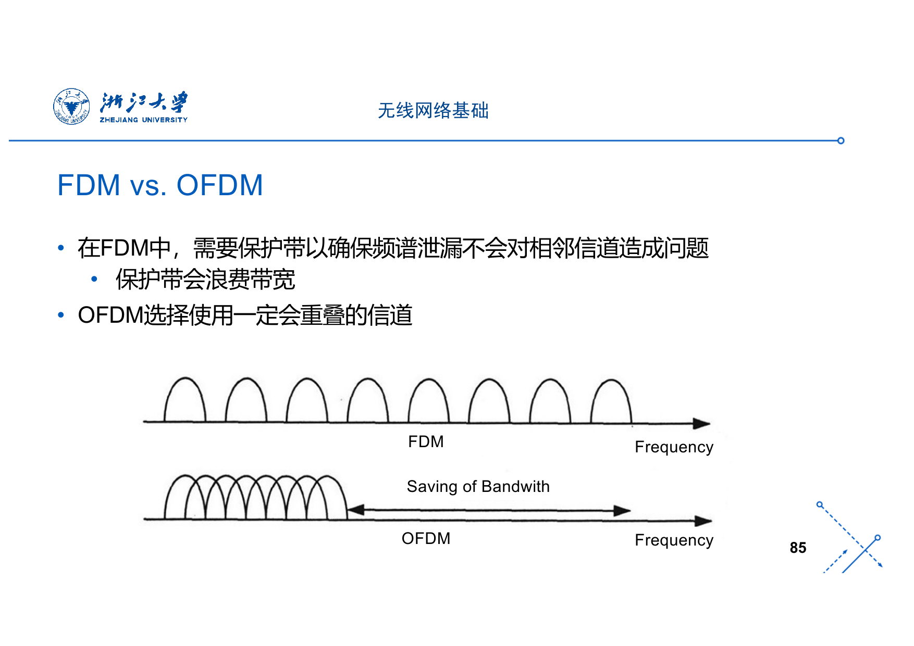

**传统FDM**:

- 子信道之间需要**保护频带（Guard Band）**防止干扰
- 保护频带不传输有用信息，造成带宽浪费
- 各子载波频谱互不重叠，有明显的频率间隔

**OFDM**:

- 子载波相互**正交（Orthogonal）**，频谱可以重叠
- 显著**节省带宽**（"Saving of Bandwidth"）
- 选择使用一定会重叠的信道
- 但由于正交性，解调时互不干扰

从频谱图上看:
- FDM 的各子载波峰值之间有间隔
- OFDM 的子载波频谱大幅重叠，但每个子载波的峰值位于相邻子载波的零点

#### 正交性的实现 (page 86)

**正交的数学含义**:

"正交"描述的是独立的个体。在数学上，如果两个子载波 $s_i(t)$ 和 $s_j(t)$ 在一个码元周期 $T$ 内的内积为零，则它们正交:

$$
\int_0^T s_i(t) \cdot s_j(t) \quad dt = 0， \quad \text{当}  i \neq j
$$

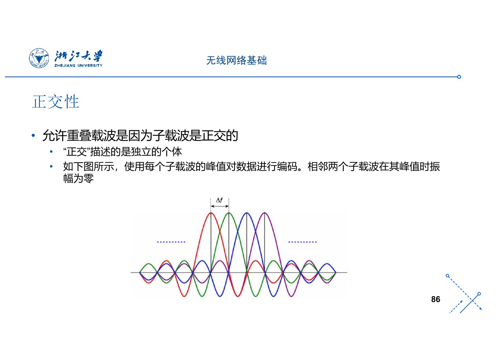

**实现方法**:

使用每个子载波的**峰值**对数据进行编码:

- 图示中展示了不同颜色的正弦波（子载波）
- 每个子载波在自己的峰值时刻采样，得到对应的数据
- 在该时刻，其他子载波的振幅为零
- 从而实现相互正交，互不干扰

**子载波间隔**:

OFDM 中，相邻子载波的频率间隔 $\Delta f$ 等于码元周期 $T_s$ 的倒数:

$$
\Delta f = \frac{1}{T_s}
$$

这样可以确保在码元周期内，子载波之间保持正交。

**例如**:

- 如果 OFDM 符号周期 $T_s = 50  \mu s$
- 则子载波间隔 $\Delta f = 1 / 50  \mu s = 20  \text{kHz}$

#### OFDM的优点

**1. 降低码间串扰（ISI） (page 87)**

OFDM 大大减少了符号间干扰。

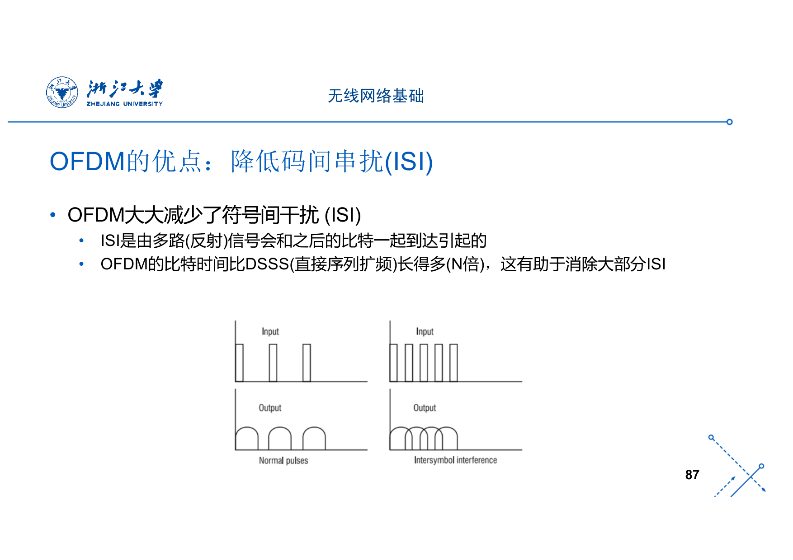

**ISI产生机制**:

ISI 是由多径（反射）信号会和之后的比特一起到达引起的:

- 在高速率单载波传输时，符号持续时间短
- 多径时延可能与符号周期相当
- 导致前一个符号干扰后续符号

**OFDM的解决机制**:

由于 OFDM 的每个子载波的比特时间比直接序列扩频系统（DSSS）长得多（$N$ 倍）:

- 符号持续时间远大于多径时延扩展
- 这有助于消除大部分 ISI

**循环前缀（Cyclic Prefix， CP）**:

OFDM 还使用循环前缀技术进一步对抗 ISI:

- 在每个 OFDM 符号前添加一段循环前缀
- CP 是符号尾部的拷贝
- CP 长度大于最大多径时延
- 吸收多径干扰，保护有用数据

**2. 干扰抑制能力强 (page 88)**

频率选择性衰落只影响某些子载波，而不会影响全部子载波。

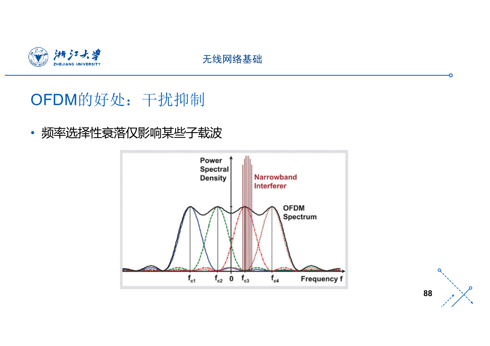

**频谱图分析**:

图示展示了功率谱密度随频率的变化:

- OFDM 将宽带信号分解为多个窄带子载波
- 当**窄带干扰（Narrowband Interferer）**出现时:
    - 只影响少数几个子载波
    - 其余子载波不受影响
    - 系统仍能正常工作

- 可以通过**自适应调制**:
    - 检测受干扰的子载波
    - 降低这些子载波的调制阶数或不使用
    - 在信噪比好的子载波上使用高阶调制
    - 动态优化系统性能

**频率选择性衰落的鲁棒性**:

- 宽带信道被分解为多个窄带子信道
- 每个子信道近似平坦衰落
- 只需简单的单抽头均衡
- 降低了接收机的复杂度

这种特性使 OFDM 在复杂电磁环境中具有很强的鲁棒性。

**OFDM 的其他优点**:

3. **高频谱效率**:
    - 子载波正交，频谱紧密排列
    - 无需保护频带

4. **易于实现**:
    - 可以用快速傅里叶变换（FFT/IFFT）高效实现
    - 调制和解调复杂度低

5. **灵活的资源分配**:
    - 可以动态分配子载波给不同用户
    - 支持 OFDMA（正交频分多址）

**OFDM 的缺点**:

1. **对频率偏移敏感**:
    - 破坏子载波正交性
    - 产生载波间干扰（ICI）

2. **峰均功率比（PAPR）高**:
    - 多个子载波叠加可能产生很高的峰值功率
    - 需要功率放大器有较大的线性范围

3. **需要精确的同步**:
    - 时间同步和频率同步要求高

### 时分复用与双工方式 (page 89-90)

#### 单工、半双工与全双工 (page 89)

**单工（Simplex）**:

两台通信设备间数据只能在一个方向上传送。在单工模式下，两台设备中一台为发送设备，另一台必为接收设备。它们之间有一条通信链路就够了。例如广播。

**半双工（Half-Duplex）**:

两台相互通信的通信设备均具有收发数据的能力，但在某一时刻内它们只能执行一种操作，不能同时执行收发两种操作。比如对讲机。

**全双工（Full-Duplex）**:

两台相互通信的通信设备可以同时发送和接收数据，即数据同时可以在两个方向上传送。所以它们之间至少需要两条通信线路。比如手机。

#### 双工技术 (page 90)

在无线通信中，实现全双工通常采用以下两种方式:

**时分双工（TDD， Time Division Duplexing）**:

收发共用一个射频频点，上下行链路使用不同的时隙来进行通信。

**特点**:
- 基站和手机在不同时刻交替发送和接收
- 频谱利用率高，只需一个频段
- 上下行时隙可灵活分配，适应非对称业务
- 上下行信道互易，便于实现波束成形

**应用**:中国移动的TD-SCDMA（3G）、TD-LTE（4G）采用TDD模式

**频分双工（FDD， Frequency Division Duplexing）**:

收发使用不同的射频频点来进行通信。

**特点**:
- 基站和手机使用不同频率同时发送和接收
- 上下行独立，无需时隙切换
- 需要成对的频段，频谱资源需求大
- 收发隔离度要求高，需要双工器

**应用**:中国联通的WCDMA（3G）、电信和联通的FDD LTE（4G）采用FDD模式

> [!example]+ TDD与FDD对比示例
>
> 图示中展示了基站与手机之间的通信:
>
> **FDD模式**:
> - 上行和下行使用不同的频率
> - 基站和手机可以同时发送和接收
>
> **TDD模式**:
> - 上行和下行使用相同频率，但在不同时隙
> - 基站发送时手机接收，手机发送时基站接收
> - 时隙分配可以根据业务需求灵活调整

## 移动通信网络 (page 91-110)

### 移动通信的分类 (page 92)

移动通信系统可以从多个维度进行分类:

**按使用对象**:
- **民用通信**:公众移动通信网络
- **军用通信**:专用保密通信系统

**按使用环境**:
- **陆地通信**:地面蜂窝网络
- **海上通信**:海事卫星通信
- **空中通信**:航空通信

**按多址方式**:
- **频分多址（FDMA）**:1G 模拟系统
- **时分多址（TDMA）**:2G GSM
- **码分多址（CDMA）**:3G WCDMA， CDMA2000
- **正交频分多址（OFDMA）**:4G LTE
- **灵活多址**:5G NR

**按覆盖范围**:
- **广域网（WAN）**:覆盖城市、省份、国家
- **局域网（LAN）**:WiFi、蓝牙

**按业务类型**:
- **电话网**:传统语音业务
- **数据网**:互联网接入
- **综合业务网**:语音、数据、多媒体

**按工作方式**:
- **单工**:
    - 同频单工:使用相同频率
    - 异频单工:使用不同频率
- **半双工**:对讲机模式
- **双工**:
    - 频分双工（FDD）
    - 时分双工（TDD）

**按服务范围**:
- **专用网**:集群通信、行业专网
- **公用网**:运营商网络

**按信号形式**:
- **模拟网**:1G AMPS， TACS
- **数字网**:2G/3G/4G/5G

### 移动通信网络的特点 (page 93)

移动通信网络具有以下显著特点:

1. **移动性**:
    - 用户可以在移动中通信
    - 需要处理位置管理和切换

2. **无线传输**:
    - 通过电磁波传输信息
    - 受传播环境影响大

3. **频谱资源有限**:
    - 频谱是稀缺资源
    - 需要高效利用

4. **信道质量时变**:
    - 受多径、衰落、干扰影响
    - 需要自适应技术

5. **功率受限**:
    - 移动终端电池容量有限
    - 需要节能设计

### 无线接入网架构 (page 94-97)

#### 基站、扇区、小区 (page 94)

> [!definition]+ 基本概念
>
> **基站（Base Station）**:
> - 一套为无线小区服务的设备
> - 通常服务一个全向小区或三个扇形小区
> - 包括天线、射频单元、基带处理单元
>
> **小区（Cell）**:
> - 基站的覆盖范围
> - 是无线网络规划的基本单元
>
> **扇区（Sector）**:
> - 使用定向天线将小区划分为多个扇区
> - 提高容量和频谱利用率

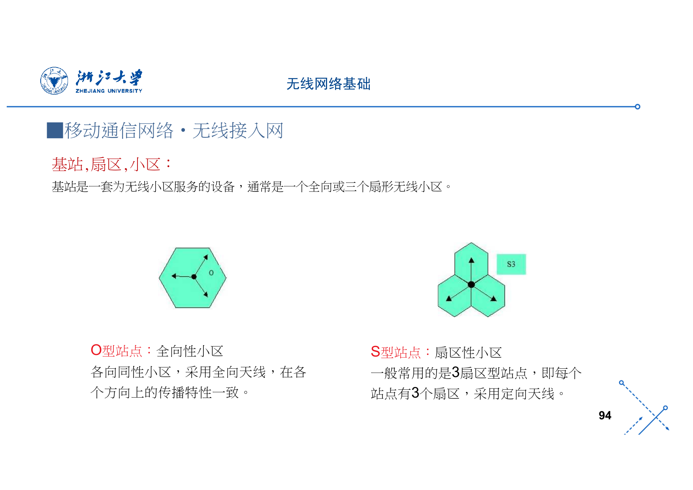

**O型站点（全向性小区）**:

- **特征**:
    - 采用全向天线
    - 在各个方向上的传播特性一致
    - 覆盖范围呈圆形

- **优点**:
    - 覆盖简单
    - 切换较少
    - 适合低密度区域

- **缺点**:
    - 容量有限
    - 干扰较大
    - 频率复用效率低

**S型站点（扇区性小区）**:

- **特征**:
    - 一般常用的是 **3扇区型站点**
    - 每个站点有 3 个扇区
    - 采用定向天线，每个扇区覆盖约 120°

- **优点**:
    - 提高容量（相比全向约 3 倍）
    - 降低同频干扰
    - 频率复用效率高
    - 可以独立控制每个扇区的参数

- **缺点**:
    - 切换更频繁
    - 规划更复杂
    - 需要更多天线

**6扇区站点**:

- 每个站点 6 个扇区，每个扇区 60°
- 进一步提高容量
- 用于高话务量热点地区

#### 蜂窝移动通信 (page 96)

移动通信系统中，基站的覆盖范围在理想化模型中是一个像蜂窝一样的六边形区域，故称作**蜂窝移动通信**。

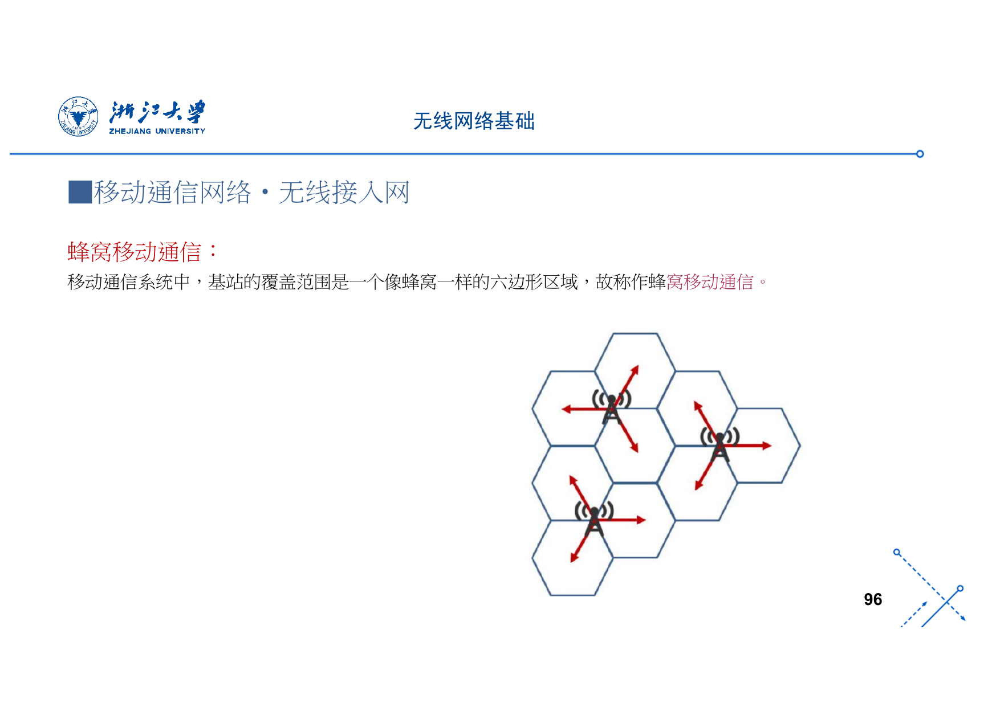

**蜂窝结构的原理**:

1. **为什么是六边形**:
    - 理论上最优的平面覆盖形状
    - 用最少的基站覆盖最大的面积
    - 实际中小区形状不规则，受地形地物影响

2. **频率复用**:
    - 相隔一定距离的小区可以使用相同频率
    - 频率复用因子:
      - $K=3$:每 3 个小区复用一次频率
      - $K=4$:每 4 个小区复用一次频率
      - $K=7$:每 7 个小区复用一次频率
    - $K$ 越小，频谱效率越高，但干扰越大

3. **同频干扰控制**:
    - 通过合理规划频率复用模式
    - 确保同频小区间距足够大
    - 降低同频干扰到可接受水平

**小区分裂**:

当某个区域话务量增加时，可以采用小区分裂技术:

- 将原大小区分为多个小小区
- 降低发射功率
- 增加频率复用次数
- 提高系统总容量

**例如**:
- 宏小区（Macro Cell）:半径 1-20 km
- 微小区（Micro Cell）:半径 100-1000 m
- 毫微小区（Pico Cell）:半径 10-100 m
- 飞小区（Femto Cell）:半径 10 m 以内

#### 天线系统 (page 98-99)

> [!definition]+ 天线
>
> 在无线电设备中，用来辐射和接收无线电波的装置称为天线。
>
> 天线是一种变换器，它把传输线上传播的导行波，变换成在无界媒介（通常是自由空间）中传播的电磁波，或者进行相反的变换。

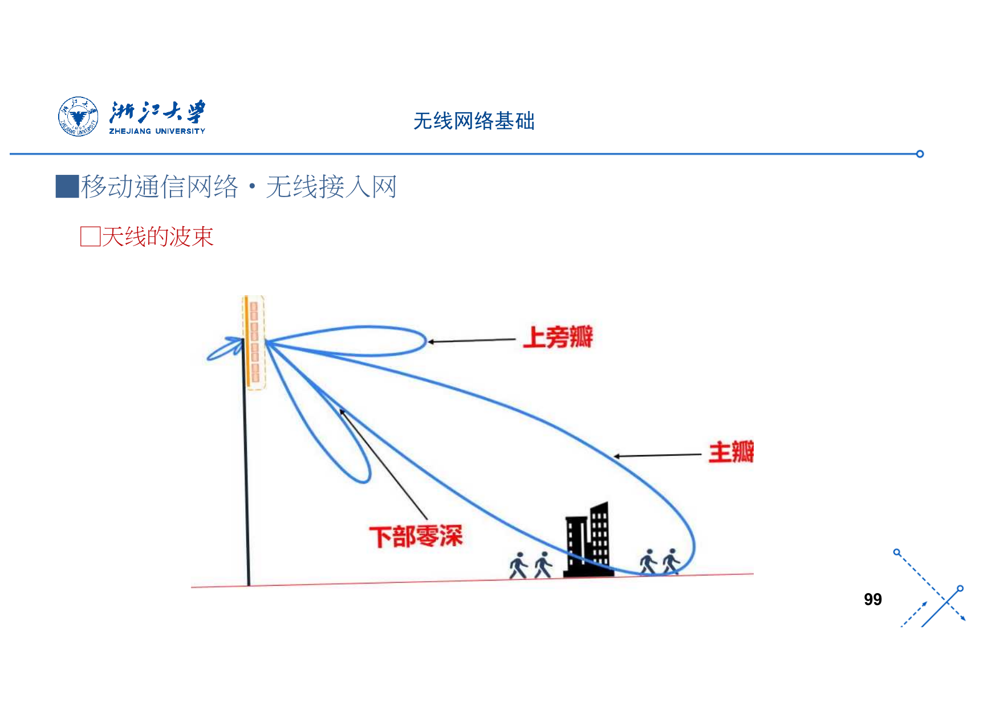

**天线的关键参数**:

1. **增益（Gain）**:
    - 天线在特定方向上集中信号能量的能力
    - 单位:dBi（相对于各向同性天线）或 dBd（相对于半波偶极子天线）
    - 关系:dBi = dBd + 2.15
    - 典型值:
      - 全向天线:2-10 dBi
      - 定向天线:15-20 dBi

2. **波束宽度**:
    - 主瓣的角度范围，通常指 3dB 波束宽度
    - **水平面波束宽度**:
      - 全向天线:360°
      - 扇区天线:60°， 90°， 120°
    - **垂直面波束宽度**:
      - 通常较窄:7°， 10°， 15°
      - 控制覆盖距离和干扰

3. **极化方式**:
    - **垂直极化**:电场垂直于地面，常用于移动通信
    - **水平极化**:电场平行于地面
    - **±45° 双极化**:LTE/5G 常用，实现 MIMO

4. **下倾角（Downtilt）**:
    - 天线主瓣向下倾斜的角度
    - **机械下倾**:物理调整天线安装角度
    - **电下倾**:通过调整相位实现，可远程调整
    - 作用:
      - 优化覆盖，避免越区覆盖
      - 降低同频干扰
      - 改善边缘用户体验

5. **前后比（Front-to-Back Ratio）**:
    - 前向辐射功率与后向辐射功率之比
    - 单位:dB
    - 典型值:20-30 dB
    - 越大越好，减少后向干扰

**天线技术的演进**:

- **1G/2G**:单天线，全向或定向
- **3G**:智能天线（2-4 天线阵列），波束成形
- **4G**:MIMO（2×2， 4×4， 8×8）
- **5G**:
    - 大规模 MIMO（64T64R， 128T128R， 256T256R）
    - 波束管理和波束追踪
    - 毫米波相控阵天线

### 移动通信核心网架构 (page 101)

移动通信网络由接入网和核心网两部分组成。

#### 2G/3G时代的核心网架构

在2G/3G时代，核心网分为两个域:

**电路域（CS， Circuit Switched）**:
- 负责打电话（语音业务）
- 采用电路交换技术
- 为每个呼叫建立专用的端到端连接

**分组域（PS， Packet Switched）**:
- 负责上网（数据业务）
- 采用分组交换技术
- 数据以分组形式传输，路由灵活

**连接方式**:

基站通过电路域连接到电话网(Public Switched Telephone Network)，通过分组域连接到互联网。手机通过基站可以同时接入两种服务。

#### 4G LTE时代的全IP核心网

4G引入了扁平化的全IP网络架构，简化了网络层次:

**核心网简化**:
- 取消了电路域，打电话功能被划掉
- 统一采用分组域，所有业务都通过IP传输

**新增组件**:
- **EPC（Evolved Packet Core）**:演进的分组核心网
- **IMS（IP Multimedia Subsystem）**:IP多媒体子系统，提供语音和多媒体业务

**语音业务**:
- 不再使用传统电路交换
- 通过VoLTE（Voice over LTE）实现IP化语音通话

> [!note]+ 4G架构的优势
>
> 扁平化的IP架构减少了信令开销，降低了时延，提高了频谱效率和数据传输速率。但早期VoLTE覆盖不完善时，需要回落到2G/3G网络进行语音通话。

### 物联网与移动通信的关系 (page 102)

#### 物联网的定义

物联网（Internet of Things， IoT）是"万物相连的互联网"，是基于互联网的延伸和扩展的网络。通过信息传感技术、通信技术及IT技术，将人、物、机与互联网结合起来，实现智能化识别、定位、跟踪、监管的功能网络。

**三大支柱**:
- **传感（Sensing）**:感知物理世界
- **通信（Communication）**:传输数据
- **IT（Information Technology）**:处理和应用数据

**应用领域**:

物联网已经形成两大应用方向:
- **消费互联网**:智能家居、可穿戴设备
- **行业互联网**:工业物联网、智慧城市、智能交通

### 移动通信行业概况 (page 103-110)

#### 移动通信标准的演进 (page 104)

移动通信技术从1G模拟制式发展到5G，经历了多代演进:

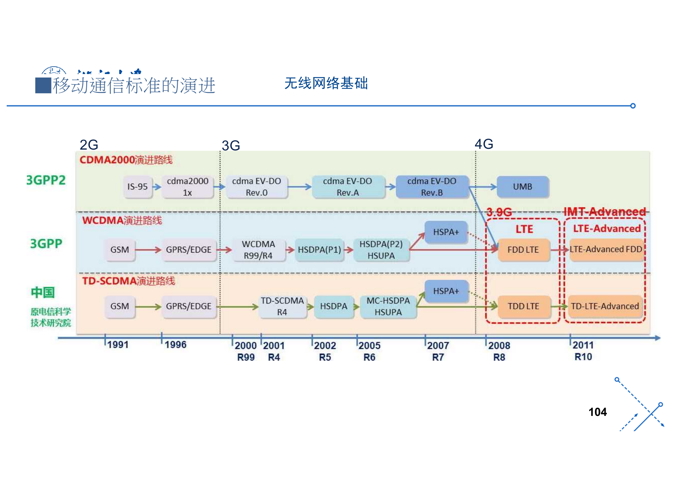

**1G时代（1980s）**:
- **制式**:AMPS（美国）、TACS（欧洲）、NMT（北欧）
- **特点**:模拟通信，仅支持语音
- **中国**:1987年开通模拟移动电话网

**2G时代（1990s）**:
- **3GPP2路线**:CDMA2000 1X（中国电信采用）
- **3GPP路线**:
    - **IS-95A**:CDMA 数字蜂窝系统
    - **GSM**（Global System for Mobile Communications）:全球移动通信系统（移动/联通采用）
    - **GPRS**（2.5G）:通用分组无线服务，支持数据传输
    - **EDGE**（2.75G）:增强数据速率 GSM 演进

**3G时代（2000s）**:
- **CDMA路线**:
    - CDMA2000 1x
    - CDMA EV-DO Rev.0/A（电信采用，下行最高 3.1 Mbps）
- **TD-SCDMA**:
    - 中国自主的 TD-SCDMA R4（移动采用）
    - Time Division - Synchronous CDMA
    - 下行最高 2.8 Mbps
- **WCDMA**:
    - WCDMA R99/R4（联通采用）
    - HSDPA（High Speed Downlink Packet Access，下行最高 7.2 Mbps）
    - HSPA+/HSUPA（上行增强）

**4G时代（2010s）**:
- **3.9G**:HSPA+、LTE（Long Term Evolution）
- **4G LTE**:
    - **FDD LTE**:电信/联通采用，理论下行速率 150 Mbps
    - **TDD LTE**:移动采用，理论下行速率 100 Mbps
    - **LTE-Advanced**:载波聚合、增强 MIMO，下行最高 1 Gbps

**5G时代（2020s）**:
- **5G NR**（New Radio）:
    - Sub-6 GHz 频段:覆盖和容量
    - 毫米波（mmWave）频段:超高速率
    - 三大应用场景:
     - eMBB（增强移动宽带）:下行峰值 20 Gbps
     - uRLLC（超可靠低时延）:时延 < 1 ms
     - mMTC（海量机器通信）:百万设备/km²

**技术演进路线图解读**:

图示显示了从 1991 年到 2011 年的演进路径:
- **1991**: 2G GSM 诞生
- **1996**: GPRS/EDGE 引入数据业务
- **2000-2001**: 3G 标准（R99/R4）商用
- **2002-2007**: 增强 3G（R5-R7），HSDPA/HSUPA
- **2008-2011**: 4G 时代（R8-R10），LTE 和 LTE-Advanced

#### 移动通信标准对比 (page 105)

下表总结了各代移动通信技术的关键参数:

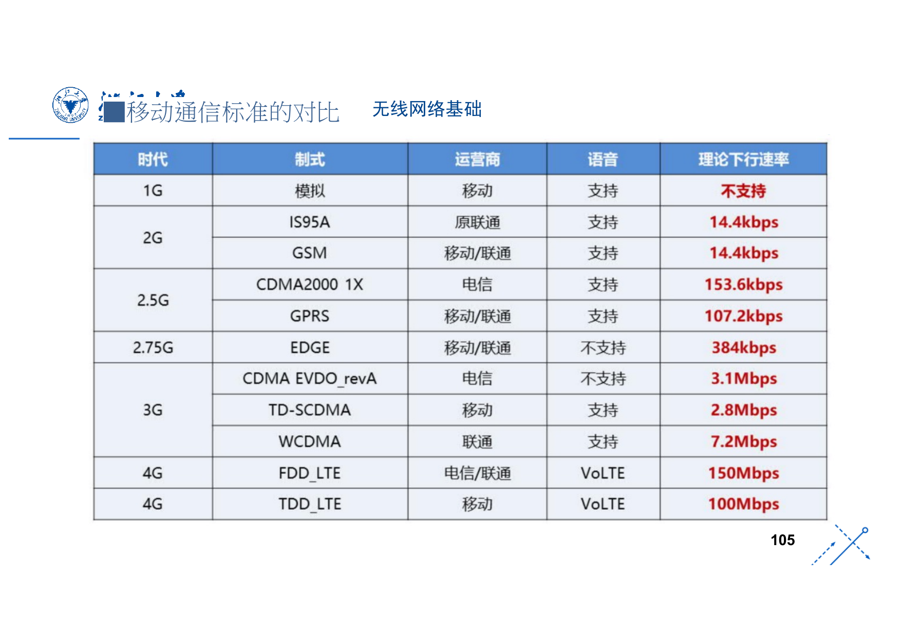

| 时代 | 制式 | 运营商 | 语音 | 理论下行速率 | 核心技术 |
|:---:|:---:|:---:|:---:|:---:|:---|
| 1G | 模拟 | 移动 | 支持 | **不支持数据** | 模拟 FM |
| 2G | IS-95A | 原联通 | 支持 | **14.4 kbps** | CDMA |
| 2G | GSM | 移动/联通 | 支持 | **14.4 kbps** | TDMA |
| 2.5G | CDMA2000 1X | 电信 | 支持 | **153.6 kbps** | CDMA |
| 2.5G | GPRS | 移动/联通 | 支持 | **107.2 kbps** | TDMA + 分组交换 |
| 2.75G | EDGE | 移动/联通 | 不支持 | **384 kbps** | 8-PSK 调制 |
| 3G | CDMA EV-DO Rev.A | 电信 | 不支持 | **3.1 Mbps** | CDMA |
| 3G | TD-SCDMA | 移动 | 支持 | **2.8 Mbps** | TDD + CDMA |
| 3G | WCDMA | 联通 | 支持 | **7.2 Mbps** | FDD + CDMA + HSDPA |
| 4G | FDD LTE | 电信/联通 | VoLTE | **150 Mbps** | OFDMA + MIMO |
| 4G | TDD LTE | 移动 | VoLTE | **100 Mbps** | OFDMA + MIMO |
| 5G | NR Sub-6 | 三大运营商 | VoNR | **1-2 Gbps** | OFDM + 大规模 MIMO |
| 5G | NR mmWave | 三大运营商 | VoNR | **10+ Gbps** | OFDM + 波束成形 |

**关键观察**:

1. **数据速率飞速提升**:
    - 从 2G 的 14.4 kbps 到 5G 的 10+ Gbps
    - 约 70 万倍的提升！

2. **语音技术演进**:
    - 1G/2G/3G:电路交换语音
    - 4G:VoLTE（Voice over LTE）IP 化语音
    - 5G:VoNR（Voice over NR）

3. **技术路线统一**:
    - 中国三大运营商采用不同的技术路线
    - 逐渐走向统一的 LTE/5G 标准

4. **调制和多址技术演进**:
    - 1G:模拟 FM + FDMA
    - 2G:数字调制 + TDMA/CDMA
    - 3G:CDMA 为主
    - 4G/5G:OFDMA + MIMO

#### 标准化组织 (page 106)

移动通信标准由多个国际组织制定和协调。

**3GPP（3rd Generation Partnership Project）**:

- **中文名**:第三代合作伙伴计划
- **成立时间**:1998 年 12 月
- **主要成员**:
    - ETSI（欧洲电信标准化协会）
    - ARIB 和 TTC（日本）
    - CCSA（中国通信标准化协会）
    - TTA（韩国）
    - ATIS（北美）
    - TSDSI（印度）
- **负责标准**:
    - WCDMA（3G）
    - TD-SCDMA（3G）
    - LTE/LTE-Advanced（4G）
    - 5G NR

**3GPP2（3rd Generation Partnership Project 2）**:

- **中文名**:第三代合作伙伴计划 2
- **成立时间**:1999 年 1 月
- **主要成员**:
    - TIA（北美电信工业协会）
    - CCSA（中国）
    - ARIB/TTC（日本）
    - TTA（韩国）
- **负责标准**:
    - CDMA2000 系列
    - EV-DO
    - UMB（未商用）

**3GPP 与 3GPP2 的关系**:

- 原本是竞争关系，分别推动不同的 3G 技术路线
- 3GPP:WCDMA 系列（欧洲、中国、日韩主流）
- 3GPP2:CDMA2000 系列（北美、中国电信）
- 4G 时代，3GPP 的 LTE 成为主流，3GPP2 逐渐边缘化
- 5G 时代，全球统一到 3GPP 的 5G NR 标准

**WiMAX（Worldwide Interoperability for Microwave Access）**:

- 由 **IEEE**（电气和电子工程师协会）提出
- 基于 IEEE 802.16 标准的宽带无线接入技术
- 曾被视为 4G 候选技术，与 LTE 竞争
- 优势:灵活的频谱使用、高峰值速率
- 劣势:生态系统弱、产业链支持不足
- **结果**:最终未能大规模商用，被 LTE 取代

**ITU（International Telecommunication Union）**:

- **中文名**:国际电信联盟
- **性质**:联合国专门机构
- **职责**:
    - 协调全球电信标准
    - 定义 IMT（International Mobile Telecommunications）系列标准
    - 分配和管理全球频谱资源
- **IMT 系列**:
    - IMT-2000:3G 标准族（包括 WCDMA， CDMA2000， TD-SCDMA）
    - IMT-Advanced:4G 标准族（LTE-Advanced， WiMAX 2）
    - IMT-2020:5G 标准族（5G NR）

**标准化流程**:

1. ITU 定义总体要求和性能指标
2. 各标准化组织（3GPP， 3GPP2， IEEE）提交候选技术
3. ITU 评估和认可
4. 各组织制定详细技术规范
5. 设备厂商实现和测试
6. 运营商部署商用网络

#### 通信行业整体架构 (page 107)

通信行业的产业链包括多个环节:

**用户层**:
- **用户/手机**:终端用户和设备
- 是整个产业链的服务对象

**运营商层**:
- **移动运营商**:
    - 中国移动、中国联通、中国电信
    - 负责网络运营和服务提供
    - 获取频谱牌照，建设和维护网络
- **监管和支撑机构**:
    - 中国铁塔:负责基站铁塔等基础设施建设，避免重复建设
    - 工信部:行业监管，频谱分配
    - 邮电规划设计院:网络规划咨询

**设备商层**:
- **主设备商**:
    - 华为、中兴、爱立信、诺基亚、三星
    - 提供端到端的网络设备（核心网、基站、传输）
    - 研发和创新的主力
- **分包商**:专业施工、安装、维护
- **代理商**:销售和技术支持
- **供应商**:提供元器件和配套产品（芯片、天线、光纤等）

**产业链关系**:

- 运营商是核心，向上服务用户，向下采购设备和服务
- 设备商提供技术和设备，是技术创新的主要驱动力
- 近年来，中国的华为、中兴在 5G 领域处于全球领先地位:
    - 华为:5G 基站出货量全球第一，拥有最多 5G 标准必要专利
    - 中兴:5G 技术积累深厚，成本控制能力强

**产业生态的演变**:

- **1G/2G 时代**:欧美厂商主导（爱立信、诺基亚、摩托罗拉）
- **3G 时代**:中国厂商崛起（华为、中兴进入主流）
- **4G 时代**:中国厂商追平欧美（华为成为全球第一）
- **5G 时代**:中国厂商引领（华为、中兴技术领先）

#### 移动通信频谱占用 (page 108-109)

频谱是无线通信的基础资源，直接决定了网络容量和覆盖能力。

**中国 2G/3G/4G 频谱分配** (page 108):

**中国移动**:
- **2G GSM**:900 MHz， 1800 MHz 频段
- **3G TD-SCDMA**:
    - 2000-2020 MHz（20 MHz 带宽）
    - 1880-1900 MHz， 2010-2025 MHz（补充频段）
- **4G TDD-LTE**:
    - 1880-1900 MHz（20 MHz）
    - 2320-2370 MHz（50 MHz）
    - 2575-2635 MHz（60 MHz）
    - 总计 130 MHz TDD 频谱

**中国联通**:
- **2G GSM**:900 MHz， 1800 MHz 频段
- **3G WCDMA**:
    - 上行:1940-1965 MHz（25 MHz）
    - 下行:2130-2155 MHz（25 MHz）
    - FDD 成对频谱
- **4G FDD-LTE**:
    - Band 3:上行 1755-1765 MHz，下行 1850-1860 MHz（2×10 MHz）
    - Band 1:上行 1940-1955 MHz，下行 2130-2145 MHz（2×15 MHz）
- **4G TDD-LTE**:
    - 2300-2320 MHz（20 MHz）
    - 2555-2575 MHz（20 MHz）

**中国电信**:
- **2G CDMA**:800 MHz 频段
- **3G CDMA2000**:800 MHz 频段
- **4G FDD-LTE**:
    - Band 1:上行 1755-1785 MHz，下行 1850-1880 MHz（2×30 MHz）
    - Band 3:部分频段
- **4G TDD-LTE**:与联通共享部分频段

**5G 频谱分配** (page 109):

中国的 5G 频谱主要分布在三个频段:

**2.6 GHz 频段（n41）**:
- **中国移动**:2515-2675 MHz（160 MHz 带宽）
- 特点:
    - TDD 模式
    - 覆盖和容量平衡
    - 移动主力频段

**3.5 GHz 频段（n78）**:
- **中国电信**:3400-3500 MHz（100 MHz 带宽）
- **中国联通**:3500-3600 MHz（100 MHz 带宽）
- 特点:
    - TDD 模式
    - 全球主流 5G 频段
    - 设备生态最成熟

**4.9 GHz 频段（n79）**:
- **中国移动**:4800-4900 MHz（100 MHz 带宽）
- **广电**:4900-4960 MHz（60 MHz）
- **军方**:4960-5000 MHz（40 MHz）
- 特点:
    - 高频段，容量大
    - 覆盖相对较差
    - 用于热点增强

**毫米波频段**（未来）:
- 24.75-27.5 GHz
- 37-42.5 GHz
- 特点:超大带宽，超高速率，但覆盖范围极小

**频段选择的权衡**:

| 频段特性 | 低频（< 1 GHz） | 中频（1-6 GHz） | 高频（> 6 GHz） | 毫米波（> 24 GHz） |
|:---:|:---:|:---:|:---:|:---:|
| **覆盖范围** | 很大 | 中等 | 较小 | 很小 |
| **穿透能力** | 强 | 中等 | 弱 | 很弱 |
| **可用带宽** | 小 | 中等 | 大 | 巨大 |
| **数据速率** | 低 | 中高 | 高 | 超高 |
| **应用场景** | 广覆盖 | 容量和覆盖平衡 | 热点增强 | 室内/固定热点 |

**WiFi 频段**:
- **2.4 GHz 频段**（2400-2483.5 MHz）:
    - 全球通用的 ISM 频段
    - IEEE 802.11b/g/n/ax
    - 13 个信道（中国），其中 1， 6， 11 互不重叠
- **5 GHz 频段**（5150-5850 MHz）:
    - IEEE 802.11a/n/ac/ax
    - 更多信道，干扰少
    - 室内和室外频段（部分需要 DFS）
- **6 GHz 频段**（5925-7125 MHz）:
    - WiFi 6E 新增频段
    - 1200 MHz 超大带宽
    - 干扰极少

> [!note]+ 频谱分配的战略意义
>
> 频谱是国家战略资源:
> - **稀缺性**:频谱总量有限，需求持续增长
> - **排他性**:授权给某个运营商后，其他人不能使用
> - **经济价值**:频谱拍卖价格高昂（欧洲 5G 频谱拍卖总额超千亿美元）
> - **技术影响**:频段选择直接影响网络性能和建设成本
>
> 中国采用行政分配方式，避免了天价拍卖，有利于快速部署 5G 网络。

#### 全球主要运营商 (page 110)

移动通信运营商遍布全球，以下是各地区的代表性运营商:

**亚洲**:

- **中国**:
    - 中国移动（China Mobile）:全球用户数最多的运营商
    - 中国联通（China Unicom）
    - 中国电信（China Telecom）

- **韩国**:
    - SK电讯（SK Telecom）:全球首个商用 5G
    - KT
    - LG U+

- **日本**:
    - NTT DoCoMo:日本最大运营商
    - KDDI（au）
    - Softbank（软银）

- **香港**:
    - 电讯盈科（PCCW）
    - 和记黄埔（3 Hong Kong）
    - 香港宽频
    - 数码通
    - 中国移动香港

- **台湾**:
    - 中华电信
    - 台湾大哥大
    - 远传电信

- **东南亚**:
    - 泰国:AIS， TelecomAsia， CAT， TOT
    - 新加坡:Singtel， StarHub， M1
    - 印度:Bharti Airtel， Vodafone， Reliance Jio， Idea， BSNL

**美洲**:

- **美国**:
    - Verizon Wireless:用户数和收入最高
    - AT&T:历史悠久，综合通信巨头
    - T-Mobile:与 Sprint 合并后成为第三大
    - Sprint:已并入 T-Mobile

- **南美**:
    - 巴西:VIVO， Claro， TIM Brasil， Oi
    - 墨西哥:Telcel， Movistar

**欧洲**:

- **英国**:
    - BT（英国电信）
    - O2（西班牙 Telefónica 旗下）
    - Vodafone UK
    - EE（现为 BT 子公司）
    - 3 UK
    - Virgin Mobile

- **德国**:
    - 德国电信（Deutsche Telekom）:欧洲最大运营商
    - Vodafone Germany
    - Telefónica Germany（O2）

- **法国**:
    - Orange（法国电信）
    - SFR
    - Bouygues Telecom
    - Free Mobile

- **西班牙**:
    - Telefónica:总部在西班牙，业务遍布拉美

**其他地区**:

- **非洲**:
    - MTN:总部南非，业务遍布非洲多国
    - Vodacom
    - Orange Africa

- **大洋洲**:
    - 澳大利亚:Telstra， Optus， Vodafone Australia
    - 新西兰:Spark， Vodafone NZ， 2degrees

**跨国运营商集团**:

- **Vodafone**（沃达丰）:
    - 总部:英国
    - 业务:遍布欧洲、非洲、亚洲
    - 全球最大的跨国运营商之一

- **Orange**:
    - 总部:法国
    - 前身:法国电信
    - 业务:欧洲和非洲为主

- **Telefónica**:
    - 总部:西班牙
    - 业务:西班牙和拉美为主
    - 品牌:O2， Movistar

- **América Móvil**:
    - 总部:墨西哥
    - 拉美最大运营商
    - 品牌:Telcel， Claro

**运营商发展趋势**:

1. **整合并购**:行业集中度提高，如美国 T-Mobile 并购 Sprint
2. **5G 投资**:巨额资金投入 5G 建设
3. **业务转型**:从传统语音向数字化服务转型
4. **虚拟运营商**（MVNO）:租用网络提供低价服务
5. **跨界竞争**:互联网公司进入通信领域

## 总结

本讲全面介绍了无线网络的核心技术基础，涵盖了从物理层到网络层的关键知识点:

### 数字通信基础 (page 1-50)

**核心概念**:
- **信号与调制**:模拟信号与数字信号的转换，调制解调技术（AM/FM/PM， ASK/FSK/PSK/QAM）
- **编码理论**:信源编码与信道编码，Turbo码等先进纠错技术
- **信道容量**:Nyquist公式和Shannon定理，揭示了带宽与信噪比对容量的根本限制

**关键公式**:

$$
C_{\text{Nyquist}} = 2B \log_2 M \quad \text{（无噪声）}
$$

$$
C_{\text{Shannon}} = B \log_2 \left(1 + \frac{S}{N}\right) \quad \text{（有噪声）}
$$

### 无线信号传播与衰落 (page 51-70)

**传播特性**:
- **路径损耗**:功率随距离衰减，实际环境中 $P_r \propto 1/d^\alpha$，其中 $\alpha = 2 \sim 5$
- **传播模式**:地波、天波、视线传播，频率越高覆盖越小但带宽越大
- **穿透损耗**:不同材料的衰减差异巨大，钢筋混凝土可达 20-45 dB

**衰落机制**:
- **多径效应**:导致快衰落，接收信号服从瑞利分布
- **阴影效应**:导致慢衰落，服从对数正态分布
- **远近效应**:CDMA 系统中的关键问题，需要功率控制
- **多普勒效应**:移动导致频移，$f_d = \frac{v \cdot f_c}{c} \cos\theta$

**抗衰落技术**:
- **分集技术**:空间、频率、时间、极化分集，N重分集可将衰落概率降至 $P^N$
- **信道编码**:检错纠错，提高可靠性
- **均衡技术**:补偿信道失真，消除 ISI
- **交织技术**:将突发错误分散为随机错误

### 多址接入技术 (page 68-90)

**四个维度的复用**:

1. **频分（FDM/FDMA）**:
    - 不同用户占用不同频率
    - 需要保护频带，频谱效率低
    - 适合模拟系统和固定分配

2. **时分（TDM/TDMA）**:
    - 不同用户占用不同时隙
    - 需要精确同步
    - 适合突发数据

3. **码分（CDM/CDMA）**:
    - 不同用户使用正交码字
    - 所有用户共享频谱和时间
    - 抗干扰能力强，软容量

4. **正交频分（OFDM/OFDMA）**:
    - 子载波正交，频谱重叠无干扰
    - 抗频率选择性衰落和 ISI
    - 4G/5G 的核心技术

**扩频技术**:
- **FHSS**:跳频扩频，抗窄带干扰，蓝牙采用
- **DSSS**:直接序列扩频，抗衰落，CDMA采用
- **扩频增益**:$G_p = B_{\text{spread}} / B_{\text{data}}$，提供抗干扰能力

**双工方式**:
- **TDD**:时分双工，上下行共用频率，频谱效率高，适合非对称业务
- **FDD**:频分双工，上下行独立频率，覆盖能力强，时延小

### 移动通信网络 (page 91-110)

**网络架构**:
- **接入网**:基站、扇区、蜂窝结构，频率复用，小区分裂
- **核心网演进**:
    - 2G/3G:电路域（CS）+ 分组域（PS）
    - 4G LTE:全 IP，EPC + IMS，VoLTE
    - 5G:服务化架构，网络切片

**标准演进**:
- **1G**:模拟，仅语音
- **2G**:数字化，GSM/CDMA，14.4 kbps
- **3G**:WCDMA/CDMA2000/TD-SCDMA，几 Mbps
- **4G LTE**:OFDMA + MIMO，100-150 Mbps
- **5G NR**:大规模 MIMO + 毫米波，Gbps 级，三大场景（eMBB/uRLLC/mMTC）

**频谱分配**:
- 低频（< 1 GHz）:广覆盖，带宽小
- 中频（1-6 GHz）:覆盖与容量平衡，主力频段
- 高频（> 6 GHz）:大容量，覆盖小
- 毫米波（> 24 GHz）:超大带宽，室内/热点

**产业生态**:
- 运营商:网络建设和运营
- 设备商:技术创新，华为/中兴领先
- 标准组织:3GPP 主导，ITU 协调

### 关键洞察

1. **容量与可靠性的权衡**:
    - 提高数据速率会降低可靠性
    - 通过编码、调制、MIMO 等技术优化权衡

2. **频谱是核心资源**:
    - 稀缺、排他、高价值
    - 频段选择影响覆盖、容量、成本

3. **技术演进方向**:
    - 更高频率:毫米波
    - 更多天线:大规模 MIMO
    - 更智能:AI 赋能
    - 更灵活:网络切片、边缘计算

4. **物理层与上层协同**:
    - 仅靠物理层无法解决所有问题
    - MAC 层、网络层的优化同样重要
    - 跨层设计成为趋势

5. **理论与实践的差距**:
    - Shannon 极限是理论上界
    - 实际系统受限于复杂度、成本、功耗
    - 现代系统已非常接近理论极限
